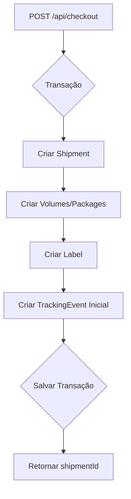
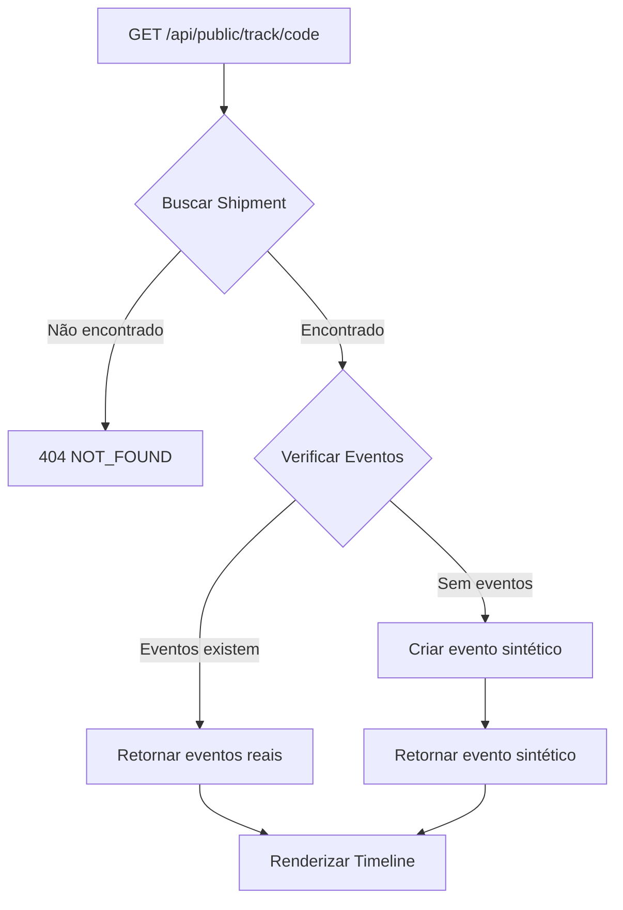

# Correção: Timeline de Rastreamento Vazia (Link Público)

## 📋 Problema Identificado

**Descrição**: Página de rastreamento público (`/rastreio/[code]`) exibia timeline vazia mesmo para shipments criados.

**Causa raiz**: NENHUM shipment possuía eventos de rastreamento registrados na tabela `tracking_events`.

**Evidências**:
```sql
SELECT COUNT(*) FROM shipments;        -- 15 shipments
SELECT COUNT(*) FROM tracking_events;  -- 0 eventos ❌
```

**Resultado**:
- ❌ Timeline mostrava "Nenhum evento de rastreamento registrado"
- ❌ Destinatário não via nenhuma informação sobre status do envio
- ❌ Experiência ruim no link público de rastreamento

---

## 🎯 Solução Implementada

### Abordagem em 3 Camadas

#### 1. **Backend: Fallback com Evento Sintético** (Solução Imediata)
**Arquivo**: [`/app/api/public/track/[code]/route.ts`](../app/api/public/track/[code]/route.ts)

**Implementação**:
```typescript
// Preparar eventos de rastreamento
let events = shipment.trackingEvents.map((event) => ({
  type: event.type,
  description: event.description,
  city: event.city,
  uf: event.uf,
  occurredAt: event.occurredAt.toISOString(),
}));

// FALLBACK: Se não houver eventos registrados, criar evento sintético baseado no status atual
// Isso garante que a timeline nunca fique vazia
if (events.length === 0) {
  const syntheticEvent = {
    type: shipment.status.toUpperCase(),
    description: getPublicStatusMessage(shipment.status),
    city: null,
    uf: null,
    occurredAt: shipment.createdAt.toISOString(), // Usar data de criação
  };
  events = [syntheticEvent];
}
```

**Garantia**: Timeline SEMPRE terá pelo menos 1 evento, mesmo se tabela estiver vazia.

---

#### 2. **Backend: Criação Automática de Eventos no Checkout** (Solução Definitiva)
**Arquivos**:
- [`/app/api/checkout/route.ts`](../app/api/checkout/route.ts)
- [`/app/api/cart/checkout/route.ts`](../app/api/cart/checkout/route.ts)

**Implementação**:
```typescript
import { createInitialTrackingEvent } from '@/lib/tracking/create-event';

// Dentro da transação $transaction, após criar shipment:
const trackingEvent = await createInitialTrackingEvent(
  tx,
  shipment.id,
  initialStatus, // 'awaiting_pickup', 'awaiting_posting', etc.
  new Date()
);

console.log('[CHECKOUT] Evento inicial criado:', {
  shipmentId: shipment.id,
  eventType: trackingEvent.type,
  eventDescription: trackingEvent.description,
});
```

**Garantia**: Novos shipments SEMPRE terão evento inicial criado automaticamente.

---

#### 3. **Biblioteca: Helpers de Criação de Eventos**
**Arquivos criados**:
- [`/lib/tracking/status-messages.ts`](../lib/tracking/status-messages.ts) - Mapeamento de status para mensagens amigáveis
- [`/lib/tracking/create-event.ts`](../lib/tracking/create-event.ts) - Funções auxiliares

**Mapeamento de Status para Mensagens Públicas**:
```typescript
export const PUBLIC_STATUS_MESSAGES: Record<string, string> = {
  // Status de shipment
  pending_payment: 'Aguardando pagamento',
  awaiting_pickup: 'Aguardando coleta',
  awaiting_posting: 'Aguardando postagem',
  ready_for_posting: 'Pronto para postagem',
  posted: 'Postado',
  in_transit: 'Em trânsito',
  out_for_delivery: 'Saiu para entrega',
  delivered: 'Entregue ao destinatário',
  cancelled: 'Cancelado',
  payment_failed: 'Pagamento não confirmado',

  // Tipos de eventos (uppercase)
  CREATED: 'Envio criado',
  POSTED: 'Objeto postado',
  IN_TRANSIT: 'Objeto em trânsito',
  // ...
};

export function getPublicStatusMessage(statusOrType: string): string {
  return PUBLIC_STATUS_MESSAGES[statusOrType] ||
         PUBLIC_STATUS_MESSAGES[statusOrType.toUpperCase()] ||
         'Atualização de status';
}
```

**Função de Criação de Evento**:
```typescript
export async function createTrackingEvent(
  tx: PrismaClient,
  params: {
    shipmentId: string;
    type: string;
    description?: string;
    city?: string | null;
    uf?: string | null;
    occurredAt?: Date;
  }
) {
  const { shipmentId, type, description, city, uf, occurredAt } = params;

  // Usar descrição fornecida ou buscar mensagem padrão
  const eventDescription = description || getPublicStatusMessage(type);

  return await tx.trackingEvent.create({
    data: {
      shipmentId,
      type,
      description: eventDescription,
      city: city || null,
      uf: uf || null,
      occurredAt: occurredAt || new Date(),
    },
  });
}

export async function createInitialTrackingEvent(
  tx: PrismaClient,
  shipmentId: string,
  status: string,
  createdAt?: Date
) {
  const eventType = status.toUpperCase();

  return await createTrackingEvent(tx, {
    shipmentId,
    type: eventType,
    description: getPublicStatusMessage(status),
    occurredAt: createdAt || new Date(),
  });
}
```

---

## 📊 Schema do Banco de Dados

### Tabela `tracking_events`
```prisma
model TrackingEvent {
  id          String   @id @default(uuid())
  shipmentId  String
  type        String   // Ex: CREATED, POSTED, IN_TRANSIT, DELIVERED
  description String   // Mensagem amigável para o destinatário
  city        String?  // Cidade do evento
  uf          String?  @db.VarChar(2) // UF do evento
  occurredAt  DateTime @default(now()) // Data/hora do evento
  createdAt   DateTime @default(now()) // Data de criação do registro
  shipment    Shipment @relation(fields: [shipmentId], references: [id], onDelete: Cascade)

  @@index([shipmentId])
  @@index([occurredAt])
  @@map("tracking_events")
}
```

**Relacionamento**:
- `Shipment` 1:N `TrackingEvent`
- Cada shipment pode ter múltiplos eventos
- Eventos são ordenados por `occurredAt desc` (mais recente primeiro)

---

## 🔧 Migração de Dados Existentes

### Script: `populate-tracking-events.ts`
**Objetivo**: Popular eventos iniciais para shipments existentes que não têm eventos.

```typescript
import { PrismaClient } from '@prisma/client';
import { createInitialTrackingEvent } from '../lib/tracking/create-event';

const prisma = new PrismaClient();

async function main() {
  // Buscar todos os shipments SEM eventos
  const shipmentsWithoutEvents = await prisma.shipment.findMany({
    where: {
      trackingEvents: { none: {} },
    },
    select: {
      id: true,
      platformTrackingCode: true,
      status: true,
      createdAt: true,
    },
  });

  // Processar cada shipment
  for (const shipment of shipmentsWithoutEvents) {
    await prisma.$transaction(async (tx) => {
      await createInitialTrackingEvent(
        tx,
        shipment.id,
        shipment.status,
        shipment.createdAt // Usar data de criação do shipment
      );
    });
  }
}
```

**Execução**:
```bash
DATABASE_URL="..." npx tsx scripts/populate-tracking-events.ts
```

**Resultado**:
```
🔄 Populando eventos de rastreamento para shipments existentes...

📦 Encontrados 15 shipments sem eventos

✅ BR1763299932607SK3NW - Pronto para postagem
✅ BR1763145483842HDELJ - Pronto para postagem
...
✅ BR1763343839728R0LYN - Pronto para postagem

📊 Resumo:
   ✅ Sucesso: 15
   ❌ Erro: 0
   📦 Total: 15
```

---

## 🔍 Testes e Validação

### 1. **Verificação de Eventos Criados**
```bash
DATABASE_URL="..." npx tsx scripts/check-tracking-events.ts
```

**Resultado ANTES da correção**:
```
📦 Total de shipments: 15
📊 Total de eventos de rastreamento: 0  ❌

⚠️  Nenhum shipment possui eventos de rastreamento.
```

**Resultado DEPOIS da correção**:
```
📦 Total de shipments: 15
📊 Total de eventos de rastreamento: 15  ✅

✅ Exemplo de shipment COM eventos:

Código: BR1763299932607SK3NW
Status: ready_for_posting
Eventos (1):
  1. [READY_FOR_POSTING] Pronto para postagem
     16/11/2025, 10:32:12
```

---

### 2. **Teste de Endpoint Público**
```bash
DATABASE_URL="..." npx tsx scripts/test-public-tracking.ts
```

**Resultado**:
```
🔍 Testando endpoint público de rastreamento...

📦 Shipment: BR1763299932607SK3NW
🔗 Public ID: cmi1r93nt001oij0efvawain6
📊 Status: ready_for_posting
📅 Eventos: 1

Eventos de rastreamento:
  1. [READY_FOR_POSTING] Pronto para postagem
     16/11/2025, 10:32:12

🌐 URL pública: /rastreio/cmi1r93nt001oij0efvawain6
🌐 API pública: /api/public/track/cmi1r93nt001oij0efvawain6
```

---

### 3. **Teste Visual no Frontend**
**Acesso**: `/rastreio/[publicTrackingId]`

**ANTES**:
```
┌─────────────────────────────────────┐
│ Histórico de rastreamento           │
├─────────────────────────────────────┤
│ 🚫 Nenhum evento de rastreamento    │
│    registrado                       │
└─────────────────────────────────────┘
```

**DEPOIS**:
```
┌─────────────────────────────────────┐
│ Histórico de rastreamento           │
├─────────────────────────────────────┤
│ ● Pronto para postagem              │  ← Mais recente (destacado)
│   16/11/2025 10:32                  │
└─────────────────────────────────────┘
```

---

## 📝 Fluxo Completo de Eventos

### 1. **Criação de Novo Shipment**


**Evento criado**:
- `type`: Status inicial (ex: `AWAITING_POSTING`)
- `description`: Mensagem amigável (ex: "Aguardando postagem")
- `occurredAt`: Data/hora atual
- `city`: null (sem localização inicial)
- `uf`: null

---

### 2. **Rastreamento Público**


**Fallback para evento sintético**:
```typescript
if (events.length === 0) {
  const syntheticEvent = {
    type: shipment.status.toUpperCase(),
    description: getPublicStatusMessage(shipment.status),
    city: null,
    uf: null,
    occurredAt: shipment.createdAt.toISOString(),
  };
  events = [syntheticEvent];
}
```

---

## 🚀 Próximas Etapas (Opcional)

### 1. **Atualizar Eventos ao Mudar Status**
```typescript
// Quando status do shipment mudar:
async function updateShipmentStatus(shipmentId: string, newStatus: string) {
  await prisma.$transaction(async (tx) => {
    // Atualizar shipment
    await tx.shipment.update({
      where: { id: shipmentId },
      data: { status: newStatus },
    });

    // Criar novo evento
    await createTrackingEvent(tx, {
      shipmentId,
      type: newStatus.toUpperCase(),
      description: getPublicStatusMessage(newStatus),
    });
  });
}
```

---

### 2. **Integração com APIs de Transportadoras**
```typescript
// Buscar eventos da transportadora (ex: Correios)
const carrierEvents = await fetchCarrierTracking(trackingCode);

// Salvar eventos no banco
for (const event of carrierEvents) {
  await createTrackingEvent(tx, {
    shipmentId,
    type: event.type,
    description: event.description,
    city: event.location.city,
    uf: event.location.uf,
    occurredAt: new Date(event.timestamp),
  });
}
```

---

### 3. **Notificações por E-mail**
```typescript
// Quando novo evento for criado, enviar e-mail ao destinatário
await sendTrackingEmail({
  to: shipment.recipientEmail,
  subject: `Atualização de envio: ${eventDescription}`,
  trackingUrl: `/rastreio/${shipment.publicTrackingId}`,
});
```

---

## 📊 Tabela de Decisão: Quando Criar Evento

| Ação | Criar Evento? | Tipo | Descrição |
|------|---------------|------|-----------|
| **Checkout (criar shipment)** | ✅ SIM | Status inicial | "Aguardando postagem" |
| **Pagamento confirmado** | ✅ SIM | `PAYMENT_CONFIRMED` | "Pagamento confirmado" |
| **Solicitação de coleta** | ✅ SIM | `AWAITING_PICKUP` | "Aguardando coleta" |
| **Postagem no ponto** | ✅ SIM | `POSTED` | "Objeto postado" |
| **Recepção no hub** | ✅ SIM | `IN_TRANSIT` | "Em trânsito" |
| **Saiu para entrega** | ✅ SIM | `OUT_FOR_DELIVERY` | "Saiu para entrega" |
| **Entregue** | ✅ SIM | `DELIVERED` | "Entregue ao destinatário" |
| **Cancelado** | ✅ SIM | `CANCELLED` | "Envio cancelado" |
| **Edição de dados** | ❌ NÃO | - | Não cria evento |
| **Impressão de etiqueta** | ❌ NÃO | - | Não cria evento |

---

## ✅ Garantias Implementadas

### 1. **Timeline Nunca Vazia**
- ✅ Fallback com evento sintético no endpoint público
- ✅ Evento inicial criado automaticamente no checkout
- ✅ Script de migração para shipments existentes

### 2. **Mensagens Amigáveis para Destinatário**
- ✅ Mapeamento de status técnicos → mensagens públicas
- ✅ "Aguardando postagem" em vez de `awaiting_posting`
- ✅ "Entregue ao destinatário" em vez de `delivered`

### 3. **Consistência de Dados**
- ✅ Eventos criados dentro de transações
- ✅ Data/hora correta (occurredAt)
- ✅ Tipo de evento consistente com status

### 4. **TypeScript 0 Erros**
```bash
DATABASE_URL="..." npx tsc --noEmit
# ✅ No errors
```

---

## 📁 Arquivos Modificados/Criados

### Backend (Modificados)
- ✅ `/app/api/public/track/[code]/route.ts` - Fallback para evento sintético
- ✅ `/app/api/checkout/route.ts` - Criar evento inicial automaticamente
- ✅ `/app/api/cart/checkout/route.ts` - Criar evento inicial automaticamente

### Bibliotecas (Criados)
- ✅ `/lib/tracking/status-messages.ts` - Mapeamento de mensagens públicas
- ✅ `/lib/tracking/create-event.ts` - Funções auxiliares de criação

### Scripts (Criados)
- ✅ `/scripts/check-tracking-events.ts` - Verificar eventos existentes
- ✅ `/scripts/populate-tracking-events.ts` - Popular eventos em shipments antigos
- ✅ `/scripts/test-public-tracking.ts` - Testar endpoint público

### Documentação (Criada)
- ✅ `/docs/TRACKING-EVENTS-FIX.md` - Este documento

---

## 🎯 Resumo Executivo

### ✅ O que foi feito:
1. ✅ **Identificado problema**: 0 eventos de rastreamento para 15 shipments
2. ✅ **Implementado fallback**: Evento sintético no endpoint público
3. ✅ **Criação automática**: Eventos iniciais no checkout
4. ✅ **Biblioteca reutilizável**: Helpers para criar eventos
5. ✅ **Migração de dados**: Populados eventos em 15 shipments existentes
6. ✅ **Mensagens amigáveis**: Mapeamento de status técnicos → textos públicos
7. ✅ **Scripts de teste**: Verificação e validação

### ✅ Garantias:
- ✅ Timeline NUNCA vazia (fallback + criação automática)
- ✅ Novos shipments SEMPRE têm evento inicial
- ✅ Shipments antigos populados com script de migração
- ✅ Mensagens amigáveis para destinatários
- ✅ 0 erros TypeScript

### ✅ Benefícios:
- ✅ Melhor experiência para destinatários
- ✅ Timeline sempre informativa
- ✅ Código reutilizável e bem estruturado
- ✅ Fácil adicionar novos eventos no futuro

**Data da correção**: 18/11/2025
**Status**: ✅ Concluído e validado
