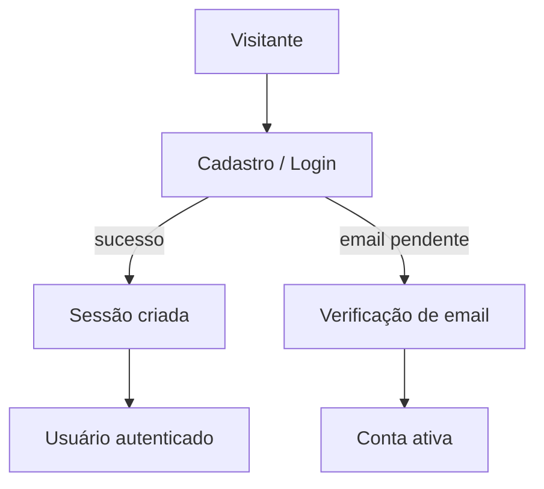
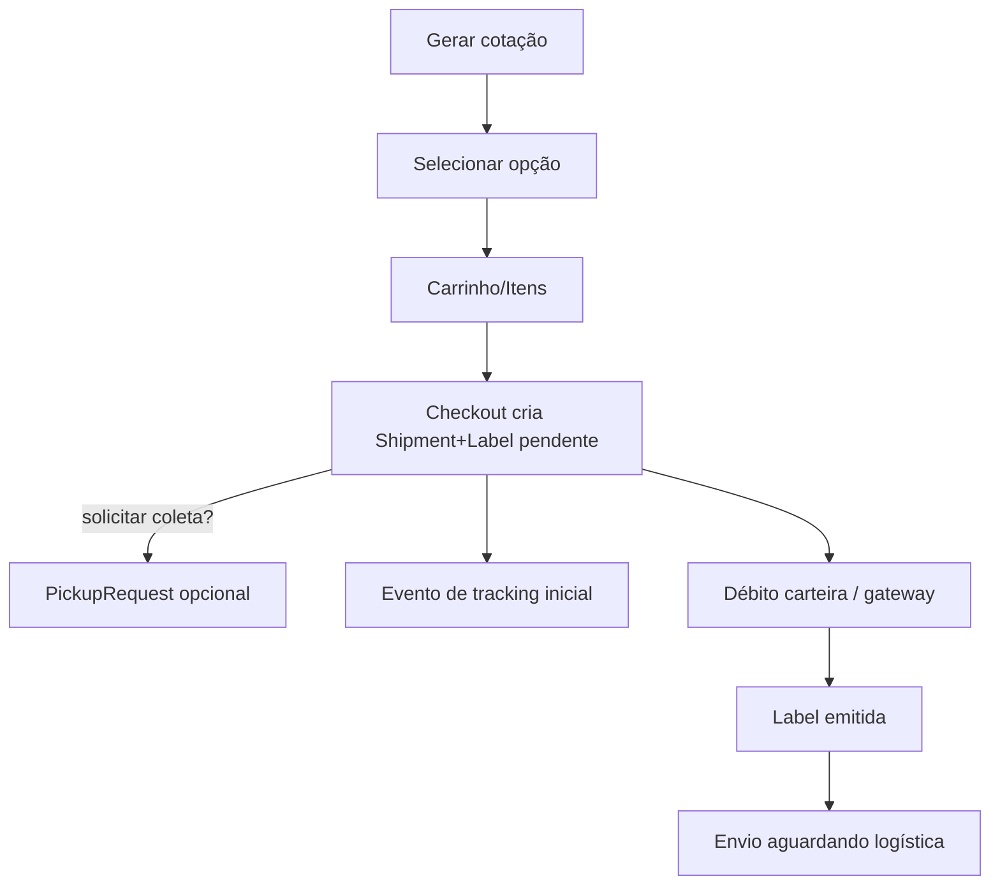
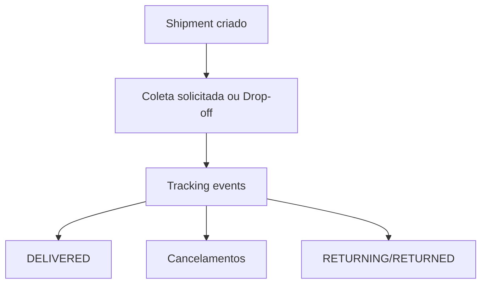
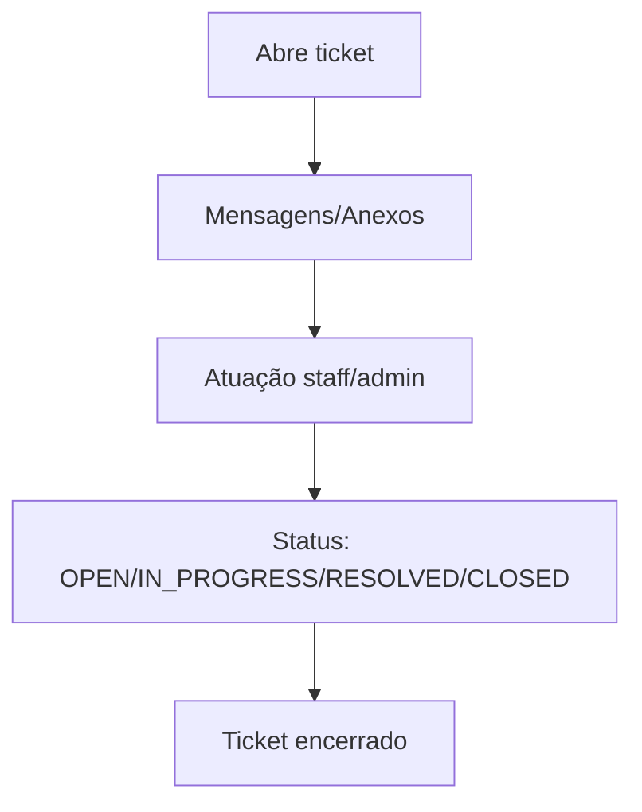
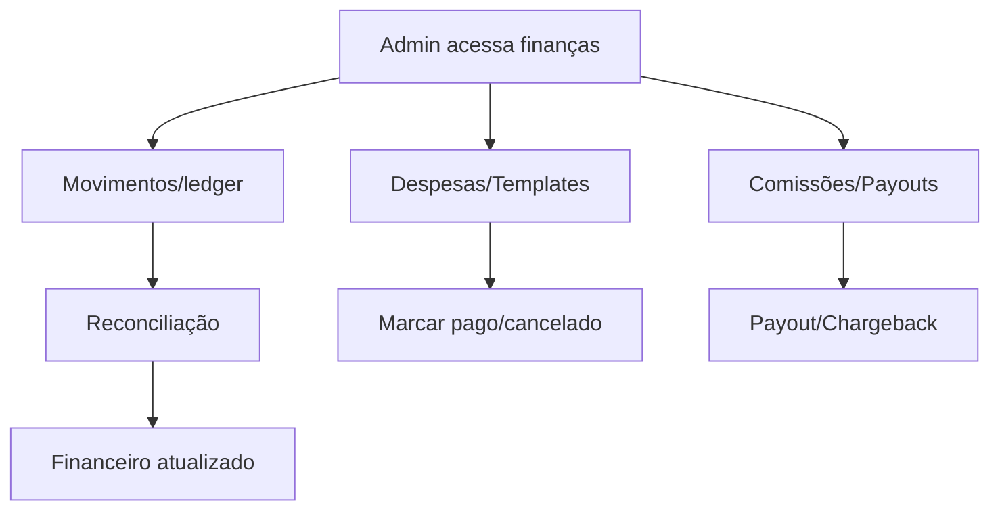

# Relatório de Fluxos (descobertos no código)

## 1) Inventário de Entradas
- **UI Routes descobertas** (page.tsx):
  - Autenticação: `app/(auth)/auth/login/page.tsx:1`, `.../cadastro/page.tsx:1`, `.../esqueci-senha/page.tsx:1`, `.../forgot-password/page.tsx:1`, `.../reset/[token]/page.tsx:1`, `.../reset-password/page.tsx:1`, `.../verify-email/page.tsx:1`, `.../confirmacao/page.tsx:1`
  - Público/coletores: `app/(public)/coletores/page.tsx:1`, `.../login/page.tsx:1`, `.../cadastro/page.tsx:1`, `.../coletas/page.tsx:1`, `.../coletas-realizadas/page.tsx:1`, `.../suporte/page.tsx:1`, `.../verificar-email/page.tsx:1`, `.../coletor/redefinir-senha/page.tsx:1`
  - Coletor área logada: `app/(collector)/collector/page.tsx:1`, `.../login/page.tsx:1`, `.../receptions/page.tsx:1`, `.../support/page.tsx:1`, `.../support/novo/page.tsx:1`
  - Admin: `app/(admin)/admin/page.tsx:1`, `.../login/page.tsx:1`, `.../logout/page.tsx:1`, `.../usuarios/page.tsx:1`, `.../coletores/page.tsx:1`, `.../coletores/[id]/page.tsx:1`, `.../pontos-de-coleta/page.tsx:1`, `.../pontos-de-coleta/[id]/page.tsx:1`, `.../financeiro/page.tsx:1`, `.../financeiro/relatorios/page.tsx:1`, `.../financeiro/movimentacoes/page.tsx:1`, `.../financeiro/repasses/page.tsx:1`, `.../financeiro/comissoes/page.tsx:1`, `.../financeiro/despesas/page.tsx:1`, `.../financeiro/summary` etc (todas as páginas listadas em `rg --files -g 'page.tsx' app`)
  - Envio (cliente): `app/(envio)/(overview)/page.tsx:1`, `.../cotar/page.tsx:1`, `.../cotacoes/page.tsx:1`, `.../cotacoes/finalizar/page.tsx:1`, `.../carrinho/page.tsx:1`, `.../shipments/page.tsx:1`, `.../shipments/[id]/page.tsx:1`, `.../coletas/page.tsx:1`, `.../coletas/[id]/page.tsx:1`, `.../coletas/nova/page.tsx:1`, `.../etiquetas/page.tsx:1`, `.../rastreamento/page.tsx:1`, `.../rastreamento/[id]/page.tsx:1`, `.../conta/perfil/page.tsx:1`, `.../minha-conta/page.tsx:1`, `.../carteira/page.tsx:1`, `.../carteira/extrato/page.tsx:1`, `.../carteira/faturas/page.tsx:1`, `.../carteira/metodos/page.tsx:1`, `.../devolucoes/page.tsx:1`, `.../suporte/page.tsx:1`, `.../suporte/[id]/page.tsx:1`, `.../suporte/novo/page.tsx:1`
  - Outros: `app/login/page.tsx:1`, `app/rastreio/[code]/page.tsx:1`
- **API Endpoints descobertos** (`route.ts`):
  - Auth (cliente): `/api/auth/login`, `/api/auth/register`, `/api/auth/verify-email`, `/api/auth/forgot-password`, `/api/auth/reset-password`, `/api/auth/resend-verification`, `/api/auth/logout`, `/api/auth/me`, `/api/auth/google`, `/api/auth/google/callback`
  - Conta (cliente): `/api/account/me`, `/api/account/profile`, `/api/account/password`, `/api/account/security/change-password`, `/api/account/company`, `/api/account/addresses`, `/api/account/addresses/[id]`, `/api/account/recipients`, `/api/account/recipients/[id]`, `/api/account/recipients/[id]/make-default`, `/api/account/cards`, `/api/account/cards/[id]`, `/api/account/cards/[id]/make-default`, `/api/account/cards/[id]/tokenize`, `/api/account/cards/[id]/create-token-backend`, `/api/account/cards/[id]/pan`, `/api/account/cards/[id]/route`, `/api/account/recipients`, `/api/account/recipients/[id]`
  - Cotação/checkout/carrinho: `/api/cotacoes`, `/api/cotacoes/[id]`, `/api/cotacoes/selecionar`, `/api/cart`, `/api/cart/items`, `/api/cart/items/[id]`, `/api/cart/[id]/unlock`, `/api/carrinho`, `/api/carrinho/[itemId]`, `/api/carrinho/checkout`, `/api/checkout`
  - Shipments: `/api/shipments`, `/api/shipments/[id]`, `/api/shipments/[id]/cancel`, `/api/shipments/[id]/payment`, `/api/shipments/payment-batch`, `/api/shipments/[id]/divergences`, `/api/shipments/[id]/manifest`
  - Pickups/Coletas: `/api/coletas`, `/api/coletas/[id]`, `/api/pickups`, `/api/pickups/[id]`, `/api/pickups/[id]/manifest`, `/api/pickup-fee/calculate`
  - Labels: `/api/labels`
  - Wallet/pagamentos: `/api/wallet`, `/api/wallet/status`, `/api/wallet/transactions`, `/api/wallet/statement/pdf`, `/api/wallet/statement/download`, `/api/wallet/debit`, `/api/wallet/resolve-debt`, `/api/payments/charge`, `/api/payments/methods`, `/api/payments/mercadopago/create`, `/api/payments/mercadopago/public-key`, `/api/payments/mercadopago/card-saved`, `/api/payments/mercadopago/...`
  - Suporte: `/api/support/tickets`, `/api/support/tickets/[id]`, `/api/support/tickets/[id]/messages`, `/api/support/tickets/[id]/attachments`
  - Rastreamento público: `/api/public/track/[code]`, `/api/tracking`
  - NFE/CEP/Geocode: `/api/nfe/parse`, `/api/cep`, `/api/cep/[cep]`, `/api/geocode`
  - Upload público: `/api/public/upload/collector-document`
  - Pontos de coleta: `/api/pickup-points`, `/api/pontos-coleta/auth/login/me/logout`, `/api/pontos-coleta/dashboard`, `/api/pontos-coleta/receptions`, `/api/pontos-coleta/receptions/[id]/register-entry`, `/api/pontos-coleta/receptions/[id]/receive`, `/api/pontos-coleta/receptions/volumes/[id]/check`, `/api/pontos-coleta/receptions/volumes/[id]/divergence`, `/api/pontos-coleta/tickets...`
  - Coletores: `/api/coletores/auth/login/register/me/logout/confirm-email/verify-email`, `/api/coletores/coletas`, `/api/coletores/coletas/[id]/registrar`, `/api/coletores/coletas/[id]/agendar`, `/api/coletores/coletas/[id]/registrar-tentativa`, `/api/coletores/coletas-realizadas`, `/api/coletores/coletas-realizadas/entregar`, `/api/coletores/suporte`, `/api/coletores/dashboard`, `/api/coletores/documentos`
  - Admin auth/config: `/api/admin/auth/login`, `/api/admin/auth/me`, `/api/admin/auth/logout`, `/api/admin/config/google-oauth`, `/api/admin/config/google-oauth/test`, `/api/admin/config/comissoes`, `/api/admin/email-config`, `/api/admin/email-config/test-connection`, `/api/admin/email-config/send-test`
  - Admin clientes: `/api/admin/clients`, `/api/admin/clients/[id]`, `/api/admin/clients/[id]/profile`, `/api/admin/clients/[id]/addresses`, `/api/admin/clients/[id]/addresses/[addressId]`, `/api/admin/clients/[id]/recipients`, `/api/admin/clients/[id]/recipients/[recipientId]`, `/api/admin/clients/[id]/cards`, `/api/admin/clients/[id]/cards/[cardId]`, `/api/admin/clients/[id]/wallet`, `/api/admin/clients/[id]/wallet/adjust`, `/api/admin/clients/[id]/wallet/route`, `/api/admin/clients/[id]/recurring-items`, `/api/admin/clients/[id]/recurring-items/[itemId]`, `/api/admin/clients/[id]/details`, `/api/admin/clients/block`, `/api/admin/clients/unblock`, `/api/admin/clients/reset-password`
  - Admin finanças: `/api/admin/finance/ledger`, `/ledger/adjustment`, `/ledger/reconcile`, `/finance/reconciliation`, `/finance/reconciliation/mark`, `/finance/summary`, `/finance/reports`, `/finance/reports/dre`, `/finance/reports/accounts-payable`, `/finance/expenses`, `/finance/expenses/[id]`, `/finance/expense-templates`, `/finance/expense-templates/[id]`, `/finance/commissions`, `/finance/commissions/[id]/approve`, `/finance/commissions/[id]/paid`, `/finance/payouts`, `/finance/payouts/[id]/paid`, `/finance/carrier-payouts`, `/finance/invoices`, `/finance/invoices/[id]/paid`, `/finance/invoices/[id]/cancel`, `/finance/profile-commissions`, `/finance/wallet-transactions`, `/finance/chargebacks`, `/finance/chargebacks/[id]`
  - Admin integrações: `/api/admin/integrations/correios`, `/.../test`, `/.../carriers`, `/.../carriers/[id]`, `/.../services`, `/.../pricing-rules`, `/.../credentials`, `/.../endpoints`, `/.../test-connection`, `/api/admin/integrations/mercadopago`, `/.../test-webhook`, `/api/admin/payment-gateway/config`
  - Admin operações/ops: `/api/admin/ops/shipments`, `/api/admin/ops/shipments/[id]`, `/.../timeline`, `/.../pickup-request`, `/.../reprocess`, `/.../bulk`, `/api/admin/ops/events`, `/api/admin/ops/events/[id]/mark`, `/.../retry`, `/api/admin/ops/pocs`, `/api/admin/ops/pocs/[id]`, `/api/admin/ops/collectors`
  - Admin ceps/fipe: `/api/admin/ceps/...`, `/api/admin/fipe/brands`, `/api/admin/fipe/models`, `/api/admin/fipe/sync`
  - Admin staff/users: `/api/admin/staff/users`, `/.../[id]`, `/.../[id]/status`, `/.../[id]/reset`
  - Admin suporte: `/api/admin/support/tickets`, `/api/admin/support/tickets/[id]`, `/.../[id]/assign`, `/.../[id]/reply`, `/.../[id]/status`
  - Dashboard/health: `/api/dashboard`, `/api/dashboard/pending-pickup-shipments`, `/api/system/status`, `/api/health`, `/api/health/db`, `/api/test-db`
  - Serviços auxiliares: `/api/packaging`, `/api/packaging/[id]`, `/api/services`, `/api/units`, `/api/invoices`, `/api/orders`, `/api/orders/[id]`, `/api/labels`, `/api/user/preferences`, `/api/wallet/resolve-debt`, `/api/wallet/status`
  - Webhooks: `/api/webhooks/mercadopago`, `/api/webhooks/pix`, `/api/webhooks/tracking`, `/api/webhooks/pickups`
- **Webhooks/Jobs/Actions descobertos**
  - Webhooks: Mercado Pago (`app/api/webhooks/mercadopago/route.ts:1`), Pix (`app/api/webhooks/pix/route.ts`), tracking (`app/api/webhooks/tracking/route.ts`), pickups (`app/api/webhooks/pickups/route.ts`)
  - Jobs/scripts (manuais): `scripts/sync-pending-payments.ts`, `scripts/approve-pending-payment.ts`, `scripts/geocode-collectors.ts`, `scripts/fipe-sync.ts`, `scripts/update-mp-credentials.ts`, `scripts/test-*` etc. (executados sob demanda).

## 2) Fluxos (catálogo completo)
Fluxos agrupados por domínio.

### Fluxo F1 – Registro e verificação de usuário
- **Entradas que disparam:** POST `/api/auth/register`; GET `/api/auth/verify-email`.
- **Perfis/atores:** Visitante.
- **Pré-condições:** Payload válido, email único; token de verificação.
- **Passo a passo detalhado:** valida zod; verifica email duplicado; cria user com status pending e token; envia email de verificação; endpoint verify marca `emailVerified` e `status=active`.
- **Decisões/ramificações:** email existente → 409; token inválido/expirado → 400; já verificado → mensagem específica.
- **Efeitos no banco:** cria `User`; atualiza `emailVerified/status`.
- **Status/Enums envolvidos:** `User.status` pending→active.
- **Integrações externas:** envio de email.
- **Respostas/erros:** 201 cadastro; 409 email; 422 validação; 400 token inválido.
- **Rastreabilidade:** `app/api/auth/register/route.ts:12-161`; `app/api/auth/verify-email/route.ts:8-90`.

### Fluxo F2 – Login e sessão de usuário
- **Entradas que disparam:** POST `/api/auth/login`; GET `/api/auth/me`; POST `/api/auth/logout`.
- **Perfis/atores:** Cliente.
- **Pré-condições:** Email verificado, `status=ACTIVE`, senha correta.
- **Passo a passo detalhado:** rate limit; valida payload; busca usuário+role; verifica senha; bloqueia se não verificado ou status diferente de ACTIVE; atualiza `lastLoginAt`; cria sessão JWT/cookie.
- **Decisões/ramificações:** senha/email inválidos → 401; email não verificado → 403; conta inativa → 403.
- **Efeitos no banco:** update `User.lastLoginAt`.
- **Status/Enums envolvidos:** `UserStatus.ACTIVE`.
- **Integrações externas:** nenhuma.
- **Respostas/erros:** 200 sucesso; 401/403/422/500.
- **Rastreabilidade:** `app/api/auth/login/route.ts:12-161`.

### Fluxo F3 – Recuperação e redefinição de senha
- **Entradas que disparam:** POST `/api/auth/forgot-password`; POST `/api/auth/reset-password`.
- **Perfis/atores:** Cliente.
- **Pré-condições:** Email cadastrado (não exposto); token válido para reset.
- **Passo a passo detalhado:** forgot: rate limit, gera token hash e expiração, cria `PasswordResetToken`, envia email; reset: valida, confere token (não usado, não expirado), atualiza `passwordHash`, `tokenVersion`, marca token used (transação).
- **Decisões/ramificações:** token inválido/expirado/used → 400; validação 422.
- **Efeitos no banco:** cria `PasswordResetToken`; atualiza `User` senha/tokenVersion.
- **Status/Enums envolvidos:** token usage; `User.tokenVersion`.
- **Integrações externas:** email reset.
- **Respostas/erros:** sucesso genérico; 400 token issues; 422 validação; 500.
- **Rastreabilidade:** `app/api/auth/forgot-password/route.ts:12-103`; `app/api/auth/reset-password/route.ts:11-135`.

### Fluxo F4 – Cotação de frete
- **Entradas que disparam:** UI `/cotacoes`; POST `/api/cotacoes`; GET `/api/cotacoes`.
- **Perfis/atores:** Cliente autenticado.
- **Pré-condições:** sessão válida; payload conforme schema.
- **Passo a passo detalhado:** valida request; `createQuote` calcula peso cúbico, chama integrações (Correios) com fallback mock, aplica comissão; persiste `Quote`, volumes, opções; GET lista com filtros/paginação.
- **Decisões/ramificações:** fallback para mock se integração indisponível; erros de validação 400.
- **Efeitos no banco:** cria `Quote`, `QuoteVolume`, `QuoteOption`; seleção gera `QuoteSelection`.
- **Status/Enums envolvidos:** `QuoteStatus` DRAFT/SELECTED/CONFIRMED/EXPIRED/CANCELED.
- **Integrações externas:** Correios; mock fallback.
- **Respostas/erros:** 201/200; 400/401/500.
- **Rastreabilidade:** `app/api/cotacoes/route.ts:17-129`; `lib/quotes/service.ts:88-168`.

### Fluxo F5 – Carrinho e itens
- **Entradas que disparam:** `/api/carrinho` (alias `/api/cart`), `/api/carrinho/[itemId]`, `/api/cart/items`.
- **Perfis/atores:** Cliente autenticado.
- **Pré-condições:** sessão válida.
- **Passo a passo detalhado:** GET cria/retorna carrinho OPEN com itens; CRUD itens (origem/destino/volumes/quote); DELETE limpa e reseta totals/meta/status OPEN.
- **Decisões/ramificações:** carrinho inexistente → 404; status LOCKED pode ser limpo.
- **Efeitos no banco:** `Cart`, `CartItem`.
- **Status/Enums envolvidos:** `Cart.status` OPEN/LOCKED.
- **Integrações externas:** nenhuma.
- **Respostas/erros:** 200/201; 400/401/404/500.
- **Rastreabilidade:** `app/api/carrinho/route.ts:12-133`.

### Fluxo F6 – Checkout e criação de envio
- **Entradas que disparam:** POST `/api/checkout`.
- **Perfis/atores:** Cliente autenticado.
- **Pré-condições:** volumes >0; documento com itens; sessão válida.
- **Passo a passo detalhado:** valida payload; calcula valor declarado; idempotência (envio similar <5min retorna existente); garante carteira; define status inicial (coleta→PICKUP_REQUESTED, ponto→AWAITING_DROP_OFF_AT_POINT); cria `Shipment` e `Package` via serviço; cria `Label` pending; cria `PickupRequest` se solicitado; cria `TrackingEvent` inicial; salva destinatário recorrente opcional; retorna URL de pagamento se gateway ativo, senão tracking.
- **Decisões/ramificações:** ausência de itens documento → 400; idempotência retorna existente; escolha de status inicial baseada em pickup/ponto.
- **Efeitos no banco:** `Shipment`, `Package`, `Label`, `PickupRequest`, `TrackingEvent`, `Recipient` opcional.
- **Status/Enums envolvidos:** `ShipmentStatus` inicial; `Label.status=pending`; `PickupRequest.status=PENDING`.
- **Integrações externas:** gateway (apenas URL).
- **Respostas/erros:** 400/401/500.
- **Rastreabilidade:** `app/api/checkout/route.ts:95-499`; `lib/shipments/create-with-volumes.ts:69-136`; `lib/tracking/create-event.ts:47-62`.

### Fluxo F7 – Pagamento via carteira
- **Entradas que disparam:** POST `/api/wallet/debit`.
- **Perfis/atores:** Cliente autenticado.
- **Pré-condições:** carteira existente e saldo suficiente; amount>0; shipmentId/referenceId.
- **Passo a passo detalhado:** valida; transação idempotente por referenceId; verifica carteira; debita `availableCents`; cria `WalletTransaction` CONFIRMED e `LedgerEntry` CHARGE; atualiza shipments (paymentMethod=WALLET, document.payment approved) e `Label` issued com PDF mock; retorna saldo.
- **Decisões/ramificações:** referenceId existente → idempotente; saldo insuficiente → erro; violação unique tratada como idempotente.
- **Efeitos no banco:** update `Wallet`; create `WalletTransaction`, `LedgerEntry`; update `Shipment` e `Label`.
- **Status/Enums envolvidos:** `WalletTxStatus`; `Label.status` issued.
- **Integrações externas:** nenhuma.
- **Respostas/erros:** 200/400/401/500.
- **Rastreabilidade:** `app/api/wallet/debit/route.ts:12-275`.

### Fluxo F8 – Listagem e detalhe de envios
- **Entradas que disparam:** GET `/api/shipments`; GET `/api/shipments/[id]`.
- **Perfis/atores:** Cliente (remetente).
- **Pré-condições:** sessão válida; ownership.
- **Passo a passo detalhado:** lista filtra por sender e exige packages; suporta busca e filtro status, paginação; detalhe busca envio com volumes/tracking/label/pickup; valida ownership; parseia documento e retorna volumes com itens, tracking ordenado.
- **Decisões/ramificações:** 401/403/404 conforme acesso; filtros opcionais.
- **Efeitos no banco:** leitura.
- **Status/Enums envolvidos:** `ShipmentStatus`.
- **Integrações externas:** nenhuma.
- **Respostas/erros:** 200/400/401/403/404/500.
- **Rastreabilidade:** `app/api/shipments/route.ts:5-188`; `app/api/shipments/[id]/route.ts:12-190`.

### Fluxo F9 – Cancelamento e exclusão de envio
- **Entradas que disparam:** POST `/api/shipments/[id]/cancel`; DELETE `/api/shipments/[id]`.
- **Perfis/atores:** Cliente.
- **Pré-condições:** envio pertence ao usuário; status permite cancelamento; não pago para deleção.
- **Passo a passo detalhado:** cancel: checa status final/cancelável; calcula próximo status de cancelamento; transação atualiza shipment status, label canceled, pickup PENDING/SCHEDULED → CANCELED; delete: só se paymentMethod ausente, deleta packages/label/tracking/shipment.
- **Decisões/ramificações:** status final → bloqueio; pickup coletada não é cancelada; deleção bloqueada se pago.
- **Efeitos no banco:** updates em Shipment/Label/PickupRequest; deletes cascata.
- **Status/Enums envolvidos:** `ShipmentStatus` cancelamento; `Label.status`; `PickupRequest.status`.
- **Integrações externas:** nenhuma.
- **Respostas/erros:** 200/400/401/403/404/500.
- **Rastreabilidade:** `app/api/shipments/[id]/cancel/route.ts:16-118`; `app/api/shipments/[id]/route.ts:196-263`.

### Fluxo F10 – Suporte (tickets cliente)
- **Entradas que disparam:** `/api/support/tickets`, `/api/support/tickets/[id]`, `/api/support/tickets/[id]/messages`, `/api/support/tickets/[id]/attachments`.
- **Perfis/atores:** Cliente autenticado.
- **Pré-condições:** sessão válida.
- **Passo a passo detalhado:** cria ticket (OPEN, prioridade MEDIUM), lista por user, detalhe com mensagens/attachments; mensagens com authorRole USER.
- **Decisões/ramificações:** status alteração via admin; anexos armazenam url/tamanho.
- **Efeitos no banco:** `SupportTicket`, `SupportMessage`, `SupportAttachment`.
- **Status/Enums envolvidos:** `SupportTicketStatus`.
- **Integrações externas:** nenhuma.
- **Respostas/erros:** padrões.
- **Rastreabilidade:** `app/api/support/tickets/*`.

### Fluxo F11 – Rastreamento público
- **Entradas que disparam:** `/api/public/track/[code]`, `/api/tracking`; UI `/rastreio/[code]`.
- **Perfis/atores:** Público.
- **Pré-condições:** tracking code válido.
- **Passo a passo detalhado:** busca shipment por `publicTrackingId`/trackingCode; retorna status e eventos.
- **Decisões/ramificações:** 404 se não encontrado.
- **Efeitos no banco:** leitura.
- **Status/Enums envolvidos:** `ShipmentStatus`.
- **Integrações externas:** nenhuma.
- **Respostas/erros:** 200/404/500.
- **Rastreabilidade:** `app/api/public/track/[code]/route.ts`; `app/api/tracking/route.ts`.

### Fluxo F12 – Gestão de carteira/recipientes/endereço/cartões
- **Entradas que disparam:** `/api/account/addresses*`, `/api/account/recipients*`, `/api/account/cards*`, `/api/account/profile`, `/api/account/password`, `/api/account/security/change-password`, `/api/account/me`.
- **Perfis/atores:** Cliente autenticado.
- **Pré-condições:** sessão válida; ownership.
- **Passo a passo detalhado:** CRUD em Address/Recipient/Card; change-password atualiza hash/tokenVersion; profile atualiza dados.
- **Decisões/ramificações:** validação/404/403.
- **Efeitos no banco:** updates/inserts/deletes; tokenVersion incrementa.
- **Status/Enums envolvidos:** `CardBrand`, flags isDefault.
- **Integrações externas:** tokenização/gateway para cartões.
- **Respostas/erros:** 200/201/400/401/403/404.
- **Rastreabilidade:** `app/api/account/*/route.ts`.

### Fluxo F13 – Webhook Mercado Pago
- **Entradas que disparam:** POST `/api/webhooks/mercadopago`.
- **Perfis/atores:** Mercado Pago.
- **Pré-condições:** assinatura x-signature; payload.
- **Passo a passo detalhado:** extrai headers/payload; chama `processWebhook` que valida assinatura, mapeia status, atualiza transação/labels/wallet.
- **Decisões/ramificações:** processado → 200; falha → 400; erro → 500 (retry).
- **Efeitos no banco:** `PaymentTransaction` updates; possivelmente `WalletTransaction`, `Shipment`.
- **Status/Enums envolvidos:** `TransactionStatus`.
- **Integrações externas:** Mercado Pago API.
- **Respostas/erros:** 200/400/500.
- **Rastreabilidade:** `app/api/webhooks/mercadopago/route.ts:22-82`; `lib/mercadopago/index.ts`.

### Fluxo F14 – Coleta (PickupRequest) e área do coletor
- **Entradas que disparam:** criação de pickup no checkout; `/api/coletores/coletas*`, `/api/coletores/coletas-realizadas*`, `/api/coletores/dashboard`, `/api/coletores/suporte*`, `/api/coletores/documentos`.
- **Perfis/atores:** Coletor autenticado; remetente ao solicitar coleta.
- **Pré-condições:** PickupRequest existente; sessão do coletor.
- **Passo a passo detalhado:** coletor agenda (`scheduleAt`), registra coleta (status COLLECTED/COMPLETED), registra tentativa (incrementa `attemptCount/notes`), entrega volumes; dashboard retorna pendências.
- **Decisões/ramificações:** pickups PENDING/SCHEDULED canceladas se shipment cancelado (fluxo F9); coletas realizadas endpoint fecha ciclo.
- **Efeitos no banco:** updates em `PickupRequest` (status, scheduleAt, attemptCount, notes).
- **Status/Enums envolvidos:** `PickupRequest.status`.
- **Integrações externas:** nenhuma.
- **Respostas/erros:** padrões.
- **Rastreabilidade:** `app/api/coletores/*`; `prisma/schema.prisma` PickupRequest.

### Fluxo F15 – Labels e divergências de volumes
- **Entradas que disparam:** `/api/labels`, `/api/shipments/[id]/divergences`.
- **Perfis/atores:** Cliente/operadores.
- **Pré-condições:** shipment existente.
- **Passo a passo detalhado:** divergência atualiza Package (hasDivergence, fields); label emitida no pagamento (F7), cancelada no cancelamento (F9).
- **Decisões/ramificações:** apenas pacotes existentes.
- **Efeitos no banco:** update `Package`; update `Label`.
- **Status/Enums envolvidos:** `Label.status`; divergence flags.
- **Integrações externas:** nenhuma (label mock PDF).
- **Respostas/erros:** padrões.
- **Rastreabilidade:** `app/api/shipments/[id]/divergences/route.ts`; `app/api/wallet/debit/route.ts`.

### Fluxo F16 – Suporte/operacional admin e staff
- **Entradas que disparam:** `/api/admin/support/tickets*`, `/api/admin/staff/users*`, `/api/admin/ops/shipments*`, `/api/admin/ops/events*`.
- **Perfis/atores:** Admin/Staff.
- **Pré-condições:** sessão admin; permissões.
- **Passo a passo detalhado:** CRUD de tickets admin, atribuição e respostas; CRUD staff users (status/reset); ops shipments (timeline, pickup-request, reprocess, bulk) e events (mark/retry).
- **Decisões/ramificações:** permissões via AdminPermission; status controlado por endpoints específicos.
- **Efeitos no banco:** `SupportTicket/Message`, `StaffUser`, `Ops events`, `Shipment` updates.
- **Status/Enums envolvidos:** `SupportTicketStatus`, `StaffStatus`, shipment statuses.
- **Integrações externas:** possivelmente reprocess chama transportadora.
- **Respostas/erros:** padrões.
- **Rastreabilidade:** `app/api/admin/support/tickets/*`; `app/api/admin/staff/users/*`; `app/api/admin/ops/shipments/*`.

### Fluxo F17 – Integrações de transportadoras e gateways (admin)
- **Entradas que disparam:** `/api/admin/integrations/carriers*`, `/api/admin/integrations/correios*`, `/api/admin/integrations/mercadopago*`, `/api/admin/payment-gateway/config`.
- **Perfis/atores:** Admin integrações.
- **Pré-condições:** sessão admin; permissões INTEGRACOES.
- **Passo a passo detalhado:** CRUD carriers/services/credentials/pricing/endpoints; testes de conexão; config MercadoPago e gateway; health checks e webhooks.
- **Decisões/ramificações:** ativar/desativar integrações; rotacionar credenciais.
- **Efeitos no banco:** Carrier*, PaymentGateway*, PaymentCredential/Endpoint/Webhook.
- **Status/Enums envolvidos:** `IntegrationStatus`, `IntegrationEnvironment`, `AuthType`.
- **Integrações externas:** transportadoras, Mercado Pago.
- **Respostas/erros:** padrões.
- **Rastreabilidade:** `app/api/admin/integrations/*`; `app/api/admin/payment-gateway/config/route.ts`.

### Fluxo F18 – Financeiro (admin)
- **Entradas que disparam:** `/api/admin/finance/ledger*`, `/finance/reconciliation*`, `/finance/summary`, `/finance/expenses*`, `/finance/expense-templates*`, `/finance/commissions*`, `/finance/payouts*`, `/finance/invoices*`, `/finance/chargebacks*`, `/finance/wallet-transactions`.
- **Perfis/atores:** Admin financeiro.
- **Pré-condições:** permissões FINANCEIRO.
- **Passo a passo detalhado:** lançamentos e reconciliação de ledger; CRUD despesas/templates; aprovação/pagamento de comissões/payouts/invoices/chargebacks; listagem de wallet transactions.
- **Decisões/ramificações:** status das despesas/invoices/commissions/payouts; ajustes e reconciliações.
- **Efeitos no banco:** `LedgerEntry`, `Expense`, `ExpenseTemplate`, `PaymentTransaction`, `PaymentChargeback`, `PaymentRefund`, `WalletTransaction`.
- **Status/Enums envolvidos:** `ExpenseStatus`, `LedgerEntryType`, `TransactionStatus`, `WalletTxStatus`.
- **Integrações externas:** gateway/pagamentos via sync endpoints.
- **Respostas/erros:** padrões.
- **Rastreabilidade:** `app/api/admin/finance/*`.

### Fluxo F19 – Ponto de coleta (hub) recepção
- **Entradas que disparam:** `/api/pontos-coleta/auth/login/me/logout`; `/api/pontos-coleta/receptions*`; `/api/pontos-coleta/receptions/volumes/[id]/check|divergence`; `/api/pontos-coleta/dashboard`; `/api/pontos-coleta/tickets*`.
- **Perfis/atores:** Operador de ponto de coleta.
- **Pré-condições:** login do pickup point.
- **Passo a passo detalhado:** autentica; registra entrada `Reception` (status PENDING); receive marca RECEIVED/PROCESSED; check/divergence marca issues; dashboard retorna métricas; tickets vinculados.
- **Decisões/ramificações:** trackingCode unique; issueType/issueDetails para divergência.
- **Efeitos no banco:** `Reception`; `SupportTicket` (pickupPointId).
- **Status/Enums envolvidos:** `ReceptionStatus`.
- **Integrações externas:** nenhuma.
- **Respostas/erros:** padrões.
- **Rastreabilidade:** `app/api/pontos-coleta/*`; `prisma/schema.prisma` Reception.

### Fluxo F20 – Webhooks Pix/Tracking/Pickups
- **Entradas que disparam:** `/api/webhooks/pix`; `/api/webhooks/tracking`; `/api/webhooks/pickups`.
- **Perfis/atores:** provedores externos.
- **Pré-condições:** payload conforme provedor.
- **Passo a passo detalhado:** valida payload; cria/atualiza PaymentTransaction (pix), TrackingEvent (tracking), PickupRequest/Shipment (pickups).
- **Decisões/ramificações:** payload inválido → 400; erro → 500 (retry externo).
- **Efeitos no banco:** updates conforme entidade alvo.
- **Status/Enums envolvidos:** `TransactionStatus`, `ShipmentStatus`, `PickupRequest.status`.
- **Integrações externas:** provedores de pix/tracking/pickup.
- **Respostas/erros:** 200/400/500.
- **Rastreabilidade:** `app/api/webhooks/pix/route.ts`; `app/api/webhooks/tracking/route.ts`; `app/api/webhooks/pickups/route.ts`.

### Fluxo F21 – Configurações e preferências
- **Entradas que disparam:** `/api/user/preferences`, `/api/account/me`, `/api/system/status`, `/api/health`.
- **Perfis/atores:** Cliente (preferences), público (health).
- **Pré-condições:** sessão válida para preferences/me.
- **Passo a passo detalhado:** update/GET preferences; me retorna dados; health/status retornam disponibilidade.
- **Decisões/ramificações:** nenhuma relevante.
- **Efeitos no banco:** update preferences (User).
- **Status/Enums envolvidos:** n/a.
- **Integrações externas:** nenhuma.
- **Respostas/erros:** padrões.
- **Rastreabilidade:** `app/api/user/preferences/route.ts`; `app/api/health/route.ts`.

### Fluxo F22 – Gestão de itens recorrentes
- **Entradas que disparam:** `/api/recurring-items*`; `/api/admin/clients/[id]/recurring-items*`.
- **Perfis/atores:** Cliente/Admin.
- **Pré-condições:** sessão válida.
- **Passo a passo detalhado:** CRUD `RecurringItem`; import/search; admin vincula a cliente.
- **Decisões/ramificações:** ownership; filtros.
- **Efeitos no banco:** `RecurringItem`.
- **Status/Enums envolvidos:** n/a.
- **Integrações externas:** nenhuma.
- **Respostas/erros:** padrões.
- **Rastreabilidade:** `app/api/recurring-items/*`; `app/api/admin/clients/[id]/recurring-items/*`.

### Fluxo F23 – Upload público de documentos de coletor
- **Entradas que disparam:** POST `/api/public/upload/collector-document`.
- **Perfis/atores:** Público (com parâmetros esperados).
- **Pré-condições:** collectorId/type fornecidos.
- **Passo a passo detalhado:** valida payload; cria/atualiza `CollectorDocument` (filename/url/type).
- **Decisões/ramificações:** unique por collectorId+type.
- **Efeitos no banco:** `CollectorDocument`.
- **Status/Enums envolvidos:** n/a.
- **Integrações externas:** storage (url).
- **Respostas/erros:** 200/201/400/409.
- **Rastreabilidade:** `app/api/public/upload/collector-document/route.ts`.

### Fluxo F24 – Páginas administrativas de integração/email/config
- **Entradas que disparam:** UI admin config/integracoes/email/gateway; APIs correspondentes.
- **Perfis/atores:** Admin.
- **Pré-condições:** login admin.
- **Passo a passo detalhado:** UI consome endpoints de configs (OAuth Google, SMTP, comissões).
- **Decisões/ramificações:** ativar/desativar configs.
- **Efeitos no banco:** `GoogleOAuthConfig`, `EmailConfig`, `PlatformCommission`.
- **Status/Enums envolvidos:** `EmailConfigStatus`.
- **Integrações externas:** SMTP, Google.
- **Respostas/erros:** padrões.
- **Rastreabilidade:** `app/api/admin/config/*`, `app/api/admin/email-config/*`.

### Fluxo F25 – Scripts/manutenções
- **Entradas que disparam:** scripts em `scripts/*` (geocode, fipe, sync payments, etc.).
- **Perfis/atores:** Operador CLI.
- **Pré-condições:** execução manual com ambiente.
- **Passo a passo detalhado:** cada script roda lógica específica (geocode, sync pagamentos, etc.).
- **Decisões/ramificações:** conforme script.
- **Efeitos no banco:** updates via Prisma.
- **Status/Enums envolvidos:** variados.
- **Integrações externas:** geocoding, MP, etc. dependendo do script.
- **Respostas/erros:** saída CLI.
- **Rastreabilidade:** arquivos em `scripts/*.ts|js`.

## 3) Subfluxos reutilizáveis (biblioteca)
- `createShipmentWithVolumes` (`lib/shipments/create-with-volumes.ts:69-136`): valida volumes>0, calcula peso total, define status inicial, cria Shipment/Package.
- `createInitialTrackingEvent` (`lib/tracking/create-event.ts:47-62`): cria evento inicial com status.
- `calculateShippingOptions/quoteCarrier` (`lib/quotes/service.ts:88-168`): cotação por transportadora com fallback mock; agrega resultados.
- `processWebhook/updatePaymentFromMercadoPago` (`lib/mercadopago/*`): valida assinatura, mapeia status de pagamento.
- `rateLimitByIP` (`lib/rate-limit.ts`): aplicado em login/forgot.
- Sessão/auth (`lib/auth/session.ts`, `lib/auth/user-session.ts`): valida tokenVersion e cria sessões.

## 4) Apêndice – Mapa de Estados
- `ShipmentStatus` (`lib/shipments/shipment-status.ts:9-285`): criação em PICKUP_REQUESTED/awaiting drop-off; cancelamentos; fases transporte/entrega; finais.
- `Label.status` (`prisma/schema.prisma:214-243`): pending→issued (pagamento)→canceled (cancel).
- `PickupRequest.status` (`prisma/schema.prisma:240-276`): PENDING→SCHEDULED/COLLECTED/FAILED/CANCELED/COMPLETED.
- `QuoteStatus` (`prisma/schema.prisma:132-151`): DRAFT→SELECTED/CONFIRMED/EXPIRED/CANCELED.
- `Cart.status` (`prisma/schema.prisma:88-109`): OPEN/LOCKED.
- `WalletTxStatus` (`prisma/schema.prisma:408-423`): PENDING/CONFIRMED/FAILED/CANCELED (débito confirma).
- `SupportTicketStatus` (`prisma/schema.prisma:476-506`): OPEN/IN_PROGRESS/RESOLVED/CLOSED.
- `ReceptionStatus` (`prisma/schema.prisma:430-463`): PENDING→RECEIVED/ISSUE_REPORTED/PROCESSED.
- `ExpenseStatus` (`prisma/schema.prisma:1168-1196`): PENDING→PAID/CANCELED.
- `StaffStatus` (`prisma/schema.prisma:240-259`): ACTIVE/BLOCKED.
- `IntegrationStatus`, `TransactionStatus`, `PickupPointStatus` conforme modelos.

# Documento de Validação Funcional – Fluxos da Plataforma Envio Legal

## 1) Visão Geral
**1.1 Perfis/Atores (descobertos)**
- Cliente (usuário padrão) – cria conta, autentica, gera cotações, paga, acompanha envios.
- Coletor – acessa área própria para coletas e suporte.
- Ponto de Coleta – autentica e registra recepção/entradas de volumes.
- Admin/Staff – opera módulos de clientes, finanças, integrações, suporte, operações, ceps/fipe.
- Integrações externas – Mercado Pago (pagamentos/webhooks), Correios (cotação), provedores de tracking/pix/pickups via webhooks.
- Público anônimo – rastreia envio via tracking público, acessa páginas públicas.

**1.2 Glossário (evidenciado no código)**
- Shipment (Envio) – registro principal de postagem/entrega com status logístico.
- Package (Volume) – volume associado ao shipment, pode ter divergência.
- Label (Etiqueta) – PDF associado ao shipment para postagem.
- Quote (Cotação) – cálculo de frete com opções e seleção.
- Cart/Carrinho – itens de cotação/volumes antes do checkout.
- Checkout – criação do shipment a partir do carrinho/seleção.
- PickupRequest (Coleta) – solicitação de coleta no endereço do remetente.
- Wallet (Carteira) – saldo do cliente, transações e ledger.
- SupportTicket – chamado de suporte (cliente/coletor/ponto).
- Reception – entrada de volume em ponto de coleta.
- PaymentTransaction – transação em gateway (Mercado Pago).
- RecurringItem – item recorrente cadastrado pelo usuário/admin.

**1.3 Módulos/Domínios inferidos**
Autenticação e conta; Cotação e carrinho; Checkout e criação de envio; Pagamentos e carteira; Rastreamento; Suporte; Coletas (coletor); Pontos de coleta; Admin clientes; Admin finanças; Admin integrações; Admin operações (ops); Recorrentes; Webhooks externos.

## 2) Mapa Macro de Jornadas
**Jornada J1 – Cadastro & Acesso**
- Início: visitante acessa páginas de login/cadastro → autentica.
- Fim: sessão criada ou email verificado.
- Atores: Cliente, Coletor, Admin.
- Artefatos: User/Collector/Staff, token de verificação, sessão.

**Jornada J2 – Cotar → Checkout → Pagar → Etiqueta**
- Início: Cliente abre cotação.
- Fim: Shipment criado, pagamento confirmado, etiqueta emitida.
- Atores: Cliente.
- Artefatos: Quote (opções), Cart/Items, Shipment, Label, WalletTransaction/PaymentTransaction, PickupRequest opcional, TrackingEvent inicial.

**Jornada J3 – Logística & Tracking**
- Início: Shipment criado.
- Fim: Entrega, cancelamento ou retorno.
- Atores: Cliente (consulta), Coletor (pickup), Ponto de coleta, Admin Ops.
- Artefatos: TrackingEvents, Updates de Shipment/Package, Label status, PickupRequest updates, Reception.

**Jornada J4 – Suporte**
- Início: Cliente/Coletor/Ponto abre ticket.
- Fim: Ticket resolvido/fechado.
- Atores: Cliente, Coletor, Ponto, Admin/Staff.
- Artefatos: SupportTicket, SupportMessage, Attachments.

**Jornada J5 – Financeiro (Admin)**
- Início: Admin acessa finanças.
- Fim: Ledger conciliado, despesas lançadas, comissões/payouts marcados.
- Atores: Admin Financeiro.
- Artefatos: LedgerEntry, Expense/ExpenseTemplate, PaymentTransaction, Chargeback/Refund, WalletTransaction.

## 3) Catálogo Completo de Fluxos
### Domínio: Autenticação e Conta (Cliente)
#### Fluxo F01 – Cadastro de usuário
- **Objetivo:** criar conta de cliente.
- **Atores/Perfis:** Visitante.
- **Entradas:** POST `/api/auth/register`; UI páginas `/auth/cadastro`.
- **Pré-condições:** payload válido (`RegisterSchema`), email único.
- **Passo a passo (feliz):**
  1. Valida dados (nome/email/senha/telefone).
  2. Verifica email não existente.
  3. Hasheia senha, gera token de verificação.
  4. Busca role `user`; cria `User` com `status=pending`, `emailVerified=false`.
  5. Envia email de verificação.
  6. Retorna confirmação e flag de envio de email.
- **Variações do fluxo:**
  - V1: Email já cadastrado → 409 e mensagem de email em uso.
  - V2: Falha de validação → 422 com lista de campos.
  - V3: Falha ao enviar email → cadastro ok, mas mensagem indicando reenvio.
- **Regras e restrições:** email único; termos aceitos (registrado no campo termsAcceptedAt).
- **Estados/Status envolvidos:** `User.status` pending; `emailVerified=false`.
- **Dados persistidos:** `User` (nome, email, passwordHash, status pending, token, roleId).
- **Integrações externas:** Envio de email de verificação.
- **Mensagens/Erros:** 201 sucesso; 409 email duplicado; 422 dados inválidos; 500 erro interno (sem detalhes de negócio).
- **Critérios de aceite:**
  - CA1: Cadastro retorna 201 e grava usuário pending com token.
  - CA2: Email duplicado responde 409 sem criar registro novo.
- **Rastreabilidade:** `app/api/auth/register/route.ts:12-161`.

#### Fluxo F02 – Verificação de email
- **Objetivo:** ativar conta via token enviado.
- **Atores/Perfis:** Cliente pendente.
- **Entradas:** GET `/api/auth/verify-email?token=...`; UI `/auth/verify-email`.
- **Pré-condições:** token presente.
- **Passo a passo (feliz):**
  1. Lê token, faz hash.
  2. Busca usuário com token e `emailVerified=false`.
  3. Atualiza `emailVerified=true`, `emailVerifiedAt`, `status=active`, limpa token.
  4. Retorna sucesso.
- **Variações do fluxo:**
  - V1: Token inválido/expirado → 400 com mensagem para solicitar novo.
  - V2: Usuário já verificado → resposta de já verificado (200).
- **Regras e restrições:** token obrigatório.
- **Estados/Status envolvidos:** pending → active.
- **Dados persistidos:** update em User (flags e status).
- **Integrações externas:** nenhuma.
- **Mensagens/Erros:** 400 token inválido; 200 sucesso/already verified.
- **Critérios de aceite:**
  - CA1: Token válido ativa conta e limpa token.
  - CA2: Token inválido não altera usuário.
- **Rastreabilidade:** `app/api/auth/verify-email/route.ts:8-90`.

#### Fluxo F03 – Login de usuário
- **Objetivo:** autenticar e criar sessão.
- **Atores/Perfis:** Cliente.
- **Entradas:** POST `/api/auth/login`; UI `/auth/login`.
- **Pré-condições:** email verificado, `status=ACTIVE`, senha correta.
- **Passo a passo (feliz):**
  1. Aplica rate limit (5 tentativas/5min).
  2. Valida payload.
  3. Busca usuário e compara senha.
  4. Bloqueia se email não verificado ou status ≠ ACTIVE.
  5. Atualiza `lastLoginAt`.
  6. Cria sessão JWT/cookie com tokenVersion.
  7. Retorna dados do usuário.
- **Variações do fluxo:**
  - V1: Email/senha inválidos → 401 genérico.
  - V2: Email não verificado → 403 com código `EMAIL_NOT_VERIFIED`.
  - V3: Status inativo → 403 “Conta inativa ou bloqueada”.
- **Regras e restrições:** rate limit por IP.
- **Estados/Status envolvidos:** `User.status=ACTIVE`; `lastLoginAt` atualizado.
- **Dados persistidos:** update `User.lastLoginAt`.
- **Integrações externas:** nenhuma.
- **Mensagens/Erros:** 401 inválido; 403 email não verificado/conta inativa; 422 validação; 500 genérico.
- **Critérios de aceite:**
  - CA1: Login com email verificado e status ativo cria sessão e retorna 200.
  - CA2: Email não verificado responde 403 e não cria sessão.
- **Rastreabilidade:** `app/api/auth/login/route.ts:12-161`.

#### Fluxo F04 – Recuperação e redefinição de senha
- **Objetivo:** permitir reset de senha.
- **Atores/Perfis:** Cliente.
- **Entradas:** POST `/api/auth/forgot-password`; POST `/api/auth/reset-password`; UIs `/auth/esqueci-senha`, `/auth/reset-password`.
- **Pré-condições:** email válido para reset; token válido para redefinição.
- **Passo a passo (feliz):**
  1. Forgot: valida email, cria `PasswordResetToken` (hash, expira em 1h), envia email com link.
  2. Reset: valida payload, hash do token, verifica registro não usado e não expirado.
  3. Hasheia nova senha, incrementa `tokenVersion`, atualiza `passwordUpdatedAt`, marca token used (transação).
  4. Retorna sucesso.
- **Variações do fluxo:**
  - V1: Email inexistente → responde sucesso genérico (não revela).
  - V2: Token inválido/expirado/used → 400 mensagens específicas.
  - V3: Validação falha → 422.
- **Regras e restrições:** rate limit no forgot (3/10min); token único e expira 1h.
- **Estados/Status envolvidos:** `PasswordResetToken.usedAt`; `User.tokenVersion` incrementado (invalida sessões).
- **Dados persistidos:** create em `PasswordResetToken`; update em `User`.
- **Integrações externas:** Email reset.
- **Mensagens/Erros:** sucessos genéricos; 400 token issues; 422 validação; 500 genérico.
- **Critérios de aceite:**
  - CA1: Token válido troca senha e incrementa tokenVersion.
  - CA2: Token expirado não altera senha e retorna 400.
- **Rastreabilidade:** `app/api/auth/forgot-password/route.ts:12-103`; `app/api/auth/reset-password/route.ts:11-135`.

#### Fluxo F05 – Gestão de perfil, endereços, destinatários, cartões (consultas e atualizações)
- **Objetivo:** manter dados da conta e meios de pagamento.
- **Atores/Perfis:** Cliente autenticado.
- **Entradas:** APIs `/api/account/me`, `/api/account/profile`, `/api/account/password`, `/api/account/security/change-password`, `/api/account/addresses*`, `/api/account/recipients*`, `/api/account/cards*`.
- **Pré-condições:** sessão válida; ownership do recurso.
- **Passo a passo (feliz):**
  1. Consultas retornam dados do usuário e coleções (endereços, destinatários, cartões) filtrando por `userId`.
  2. Criação/edição valida payloads (schemas) e grava em tabelas correspondentes.
  3. Change-password valida senha atual e atualiza `passwordHash/tokenVersion`.
- **Variações do fluxo:** Erros de validação → 400/422; recursos inexistentes → 404; falta de permissão → 403.
- **Regras e restrições:** `Address/Recipient/Card` vinculados a user; fingerprints únicos para cartão; flags de default.
- **Estados/Status envolvidos:** `Card.isDefault`; `Address.isDefault`; `User.tokenVersion`.
- **Dados persistidos:** CRUD em `Address`, `Recipient`, `Card`, campos de User.
- **Integrações externas:** tokenização/cartões podem chamar gateway (e.g., MercadoPago) nos endpoints de tokenize/create-token.
- **Mensagens/Erros:** padrões HTTP 200/201/400/401/403/404/422/500.
- **Critérios de aceite:**
  - CA1: Operações só afetem registros do próprio usuário.
  - CA2: Troca de senha incrementa tokenVersion e invalida sessões antigas.
- **Rastreabilidade:** arquivos `app/api/account/*/route.ts` (linhas 1+).

### Domínio: Cotação e Carrinho
#### Fluxo F06 – Geração de cotação
- **Objetivo:** calcular opções de frete.
- **Atores/Perfis:** Cliente autenticado.
- **Entradas:** POST `/api/cotacoes`; UI `/cotacoes`.
- **Pré-condições:** sessão válida; payload conforme `quoteRequestSchema`.
- **Passo a passo (feliz):**
  1. Valida request; normaliza CEPs e volumes.
  2. Chama `createQuote` que calcula cubic weight, aplica regras, chama transportadoras.
  3. Tenta Correios real; se indisponível, fallback para mock; agrega resultados.
  4. Persiste `Quote`, `QuoteVolume`, `QuoteOption`; retorna opções e pontos parceiros.
- **Variações do fluxo:**
  - V1: Validação falha → 400 com detalhes.
  - V2: Integração Correios indisponível → usa mock e indica source `mock`.
- **Regras e restrições:** volumes obrigatórios; CEPs válidos; fallback permitido.
- **Estados/Status envolvidos:** `QuoteStatus=DRAFT` na criação.
- **Dados persistidos:** tabelas de Quote e opções.
- **Integrações externas:** Correios (quote), fallback mock.
- **Mensagens/Erros:** 201 sucesso; 400 dados inválidos; 401 não autenticado; 500 erro de cálculo.
- **Critérios de aceite:**
  - CA1: Com Correios fora, ainda retorna opções mock.
  - CA2: Resultado inclui expiresAt e lista de opções ordenáveis.
- **Rastreabilidade:** `app/api/cotacoes/route.ts:17-77`; `lib/quotes/service.ts:88-168`.

#### Fluxo F07 – Seleção/atualização de cotação e listagem
- **Objetivo:** selecionar opção e consultar histórico.
- **Atores/Perfis:** Cliente.
- **Entradas:** POST `/api/cotacoes/selecionar`; GET `/api/cotacoes`; GET `/api/cotacoes/[id]`.
- **Pré-condições:** sessão válida; quote pertence ao usuário.
- **Passo a passo (feliz):**
  1. Seleção grava `QuoteSelection` e status `SELECTED`.
  2. Listagem aplica filtros (page/limit/status/sort/order) e retorna paginação.
  3. Detalhe retorna volumes, opções e seleção.
- **Variações:** Validação de params → 400; não autenticado → 401.
- **Regras:** ownership; quote não expirada.
- **Estados/Status:** `QuoteStatus SELECTED/CONFIRMED/EXPIRED/CANCELED` conforme ações subsequentes.
- **Dados persistidos:** update em `QuoteSelection`/`Quote.status`.
- **Integrações externas:** nenhuma.
- **Mensagens/Erros:** padrões.
- **Critérios de aceite:**
  - CA1: Seleção não permitida para quote de outro usuário.
  - CA2: Listagem respeita paginação e filtros.
- **Rastreabilidade:** `app/api/cotacoes/route.ts:86-129`.

#### Fluxo F08 – Gestão de carrinho
- **Objetivo:** manter itens antes do checkout.
- **Atores/Perfis:** Cliente.
- **Entradas:** GET/DELETE `/api/carrinho` (alias `/api/cart`); POST/PUT/DELETE `/api/carrinho/[itemId]`; `/api/carrinho/checkout`.
- **Pré-condições:** sessão válida.
- **Passo a passo (feliz):**
  1. GET cria/retorna carrinho OPEN com itens.
  2. CRUD de itens adiciona origens/destinos/volumes/preferences/selectedQuote.
  3. DELETE limpa itens e reseta status/totals/meta.
- **Variações:** Carrinho não encontrado → 404; validação de item → 400.
- **Regras:** status permitido OPEN/LOCKED para limpeza; totals resetados ao limpar.
- **Estados/Status:** `Cart.status` OPEN/LOCKED.
- **Dados persistidos:** `Cart`, `CartItem`.
- **Integrações externas:** nenhuma.
- **Mensagens/Erros:** 200/201; 400/401/404/500.
- **Critérios de aceite:**
  - CA1: GET cria carrinho se não existir.
  - CA2: DELETE deixa carrinho em OPEN com totals zerados.
- **Rastreabilidade:** `app/api/carrinho/route.ts:12-133`.

### Domínio: Checkout, Shipment, Pagamento, Rastreamento
#### Fluxo F09 – Checkout e criação de envio
- **Objetivo:** converter cotação em shipment e etiqueta pendente.
- **Atores/Perfis:** Cliente.
- **Entradas:** POST `/api/checkout`.
- **Pré-condições:** sessão válida; documentos com itens; volumes >0.
- **Passo a passo (feliz):**
  1. Valida payload (documento/volumes/endereços).
  2. Calcula valor declarado (por volume ou itens).
  3. Idempotência: se shipment similar <5min, retorna existente.
  4. Garante carteira; define status inicial (coleta → `PICKUP_REQUESTED`, drop-off → `AWAITING_DROP_OFF_AT_POINT`).
  5. Cria `Shipment` + `Package` via subfluxo SF1; cria `Label` pending; opcional `PickupRequest` PENDING; cria `TrackingEvent` inicial.
  6. Salva destinatário recorrente se solicitado.
  7. Se gateway ativo, retorna URL de pagamento; senão retorna tracking info.
- **Variações do fluxo:**
  - V1: Falta itens de documento → 400 `MISSING_DOCUMENT_ITEMS`.
  - V2: Idempotência encontra shipment → retorna existente sem recriar.
  - V3: SolicitarColeta=false com pickupPointId → status inicial drop-off.
- **Regras e restrições:** volumes >0; documento obrigatório; status inicial baseado em coleta/ponto; idempotência por comparação de campos e janela de 5min.
- **Estados/Status envolvidos:** Shipment status inicial; Label `pending`; PickupRequest `PENDING`.
- **Dados persistidos:** `Shipment`, `Package`, `Label`, `PickupRequest`, `TrackingEvent`, opcional `Recipient`.
- **Integrações externas:** Gateway (URL); nenhuma chamada de cobrança aqui.
- **Mensagens/Erros:** 400 validação; 401 não autenticado; 500 genérico.
- **Critérios de aceite:**
  - CA1: Shipment criado sempre tem pelo menos um Package.
  - CA2: Requisição idêntica em <5min retorna mesmo shipment.
- **Subfluxo SF1:** `createShipmentWithVolumes` (valida volumes, calcula peso, cria shipment+packages).
- **Rastreabilidade:** `app/api/checkout/route.ts:95-499`; `lib/shipments/create-with-volumes.ts:69-136`; `lib/tracking/create-event.ts:47-62`.

#### Fluxo F10 – Pagamento via carteira (envios e outros)
- **Objetivo:** debitar carteira e emitir etiqueta.
- **Atores/Perfis:** Cliente.
- **Entradas:** POST `/api/wallet/debit`.
- **Pré-condições:** sessão válida; `amount>0`; saldo suficiente.
- **Passo a passo (feliz):**
  1. Valida shipmentId/referenceId e amount.
  2. Transação: checa idempotência por referenceId; verifica carteira e saldo.
  3. Debita `availableCents`; cria `WalletTransaction` CONFIRMED e `LedgerEntry` CHARGE.
  4. Atualiza shipments vinculados: `paymentMethod=WALLET`, document.payment approved, e label `issued` com PDF mock.
  5. Retorna saldo e id transação.
- **Variações do fluxo:**
  - V1: referenceId já usado → retorna ok idempotente.
  - V2: Saldo insuficiente → 400 code `INSUFFICIENT_FUNDS`.
  - V3: Violação unique (P2002) → trata como idempotente se existir transação.
- **Regras e restrições:** only user’s wallet; shipmentId opcional se referenceId fornecido; amount >0.
- **Estados/Status envolvidos:** `WalletTransaction status=CONFIRMED`; `Label.status=issued`.
- **Dados persistidos:** update `Wallet`; create `WalletTransaction`, `LedgerEntry`; update `Shipment` document/payment; update `Label`.
- **Integrações externas:** nenhuma (mock).
- **Mensagens/Erros:** 200 ok/idempotent; 400 saldo insuficiente/dados inválidos; 401 não autorizado; 500 genérico.
- **Critérios de aceite:**
  - CA1: referenceId único garante idempotência.
  - CA2: Após pagamento, label fica `issued` e shipment document contém payment aprovado.
- **Rastreabilidade:** `app/api/wallet/debit/route.ts:12-275`.

#### Fluxo F11 – Consulta de envios
- **Objetivo:** listar envios do cliente com filtros e paginação.
- **Atores/Perfis:** Cliente.
- **Entradas:** GET `/api/shipments`.
- **Pré-condições:** sessão válida.
- **Passo a passo (feliz):**
  1. Filtra por `senderId` e exige packages existentes.
  2. Aplica busca textual e filtro de status (mapa UI→backend).
  3. Pagina (page/limit) e ordena por createdAt desc.
  4. Retorna itens com status UI, divergências, pickup info, label URL e tracking URL.
- **Variações:** status “Todos” não filtra; q vazio não aplica OR.
- **Regras:** só shipments do usuário.
- **Estados/Status:** quaisquer do `ShipmentStatus`; mapeamento UI.
- **Dados persistidos:** leitura.
- **Integrações externas:** nenhuma.
- **Mensagens/Erros:** 200; 401 se não logado; 500 erro busca.
- **Critérios de aceite:**
  - CA1: Lista só shipments com pelo menos 1 volume.
  - CA2: Paginação retorna totalPages e flags hasNext/Prev.
- **Rastreabilidade:** `app/api/shipments/route.ts:5-188`.

#### Fluxo F12 – Detalhe de envio e volumes
- **Objetivo:** obter detalhes completos de um envio.
- **Atores/Perfis:** Cliente.
- **Entradas:** GET `/api/shipments/[id]`; UI `/shipments/[id]`.
- **Pré-condições:** sessão válida; ownership.
- **Passo a passo (feliz):**
  1. Busca shipment com packages, trackingEvents, label, pickupRequest.
  2. Valida que senderId é do usuário.
  3. Parseia documento (NFE/DECLARACAO) para listar nfeKeys/items.
  4. Mapeia packages → volumes com itens por volume (se houver).
  5. Serializa datas e retorna pickup/label/tracking.
- **Variações:** 404 se não existe; 403 se não pertence.
- **Regras:** acesso restrito ao remetente.
- **Estados/Status:** apenas leitura; mostra status atual.
- **Dados persistidos:** leitura.
- **Integrações externas:** nenhuma.
- **Mensagens/Erros:** 200; 401/403/404/500.
- **Critérios de aceite:**
  - CA1: Documento retornado distingue NFE/DECLARACAO e inclui chaves/itens.
  - CA2: Volumes vêm ordenados por packageNumber.
- **Rastreabilidade:** `app/api/shipments/[id]/route.ts:12-190`.

#### Fluxo F13 – Cancelamento de envio
- **Objetivo:** registrar cancelamento conforme status.
- **Atores/Perfis:** Cliente.
- **Entradas:** POST `/api/shipments/[id]/cancel`.
- **Pré-condições:** sessão válida; envio pertence ao cliente; não em status final; status permitido para cancelamento.
- **Passo a passo (feliz):**
  1. Verifica ownership e status atual.
  2. Checa se status é final; se não, avalia `canBeCancelled`.
  3. Calcula próximo status de cancelamento (`getNextCancellationStatus`).
  4. Transação: atualiza Shipment para status de cancelamento; Label → `canceled`; PickupRequest → `CANCELED` se PENDING/SCHEDULED.
  5. Retorna mensagem conforme tipo (antes ou em trânsito).
- **Variações:** status final → 400; status não cancelável → 400; erro de cálculo → 500.
- **Regras:** FINAL_STATUSES bloqueiam; pickups coletadas não são canceladas.
- **Estados/Status:** Shipment transita para `CANCELLATION_REQUESTED_BEFORE_HANDOFF` ou `CANCELLATION_REQUESTED_IN_TRANSIT`; Label `canceled`; PickupRequest `CANCELED`.
- **Dados persistidos:** updates em Shipment, Label, PickupRequest.
- **Integrações externas:** nenhuma.
- **Mensagens/Erros:** 400/401/403/404/500.
- **Critérios de aceite:**
  - CA1: Cancelamento antes da postagem retorna mensagem “Envio cancelado com sucesso”.
  - CA2: Cancelamento em trânsito retorna mensagem de solicitação registrada.
- **Rastreabilidade:** `app/api/shipments/[id]/cancel/route.ts:16-118`; `lib/shipments/shipment-status.ts:173-204`.

#### Fluxo F14 – Exclusão de envio sem pagamento
- **Objetivo:** excluir envio não pago.
- **Atores/Perfis:** Cliente.
- **Entradas:** DELETE `/api/shipments/[id]`.
- **Pré-condições:** sessão válida; ownership; `paymentMethod` nulo.
- **Passo a passo (feliz):**
  1. Busca shipment, valida pertença.
  2. Verifica ausência de paymentMethod.
  3. Transação: deleta packages, labels, trackingEvents e shipment.
  4. Retorna confirmação.
- **Variações:** shipment pago → 400; não encontrado → 404.
- **Regras:** não deletar pagos.
- **Estados/Status:** n/a.
- **Dados persistidos:** deletes cascata.
- **Integrações externas:** nenhuma.
- **Mensagens/Erros:** 200; 400/401/403/404/500.
- **Critérios de aceite:**
  - CA1: Deleção não permitida se paymentMethod definido.
  - CA2: Todos os vínculos (packages/labels/tracking) são removidos na transação.
- **Rastreabilidade:** `app/api/shipments/[id]/route.ts:196-263`.

#### Fluxo F15 – Rastreamento público
- **Objetivo:** permitir consulta pública de status.
- **Atores/Perfis:** Público/Cliente.
- **Entradas:** GET `/api/public/track/[code]`; UI `/rastreio/[code]`.
- **Pré-condições:** código válido.
- **Passo a passo (feliz):**
  1. Busca shipment por `publicTrackingId` ou tracking code.
  2. Retorna eventos ordenados, status, destino e links.
- **Variações:** código inexistente → 404.
- **Regras:** endpoint público, sem autenticação.
- **Estados/Status:** exibe status atual.
- **Dados persistidos:** leitura.
- **Integrações externas:** nenhuma.
- **Mensagens/Erros:** 200/404/500.
- **Critérios de aceite:**
  - CA1: Consulta não exige login.
  - CA2: Eventos retornam ordenados por occurredAt desc.
- **Rastreabilidade:** `app/api/public/track/[code]/route.ts:1+`; `app/api/tracking/route.ts:1+`.

### Domínio: Suporte
#### Fluxo F16 – Tickets de suporte do cliente
- **Objetivo:** abrir e interagir com tickets.
- **Atores/Perfis:** Cliente autenticado.
- **Entradas:** POST/GET `/api/support/tickets`; GET/PUT `/api/support/tickets/[id]`; POST `/api/support/tickets/[id]/messages`; POST `/api/support/tickets/[id]/attachments`.
- **Pré-condições:** sessão válida; ticket pertence ao usuário.
- **Passo a passo (feliz):**
  1. Cria ticket com subject/description, status `OPEN`, prioridade `MEDIUM`.
  2. Lista tickets do usuário com paginação/filtros (status/priority).
  3. Detalhe retorna mensagens e anexos.
  4. Mensagens adicionadas com `authorRole=USER`.
- **Variações:** atualização de status ocorre via admin; anexos salvos com url/filename.
- **Regras:** visibilidade por `userId`; status controlado por staff para mudança.
- **Estados/Status:** `SupportTicketStatus` OPEN/IN_PROGRESS/RESOLVED/CLOSED.
- **Dados persistidos:** `SupportTicket`, `SupportMessage`, `SupportAttachment`.
- **Integrações externas:** nenhuma.
- **Mensagens/Erros:** padrões.
- **Critérios de aceite:**
  - CA1: Usuário só vê tickets próprios.
  - CA2: Criação define status OPEN e prioridade MEDIUM por padrão.
- **Rastreabilidade:** `app/api/support/tickets/*`.

### Domínio: Coletas (Coletor)
#### Fluxo F17 – Operação de coletas pelo coletor
- **Objetivo:** permitir que coletor gerencie coletas atribuídas.
- **Atores/Perfis:** Coletor autenticado.
- **Entradas:** `/api/coletores/auth/login/register/me/logout/confirm-email/verify-email`; `/api/coletores/coletas*`; `/api/coletores/coletas-realizadas*`; `/api/coletores/dashboard`; `/api/coletores/suporte*`; `/api/coletores/documentos`.
- **Pré-condições:** credenciais de coletor; email verificado para operações protegidas.
- **Passo a passo (feliz):**
  1. Login cria sessão do coletor.
  2. Lista coletas atribuídas; registrar coleta (`registrar`), agendar (`agendar` com scheduleAt), registrar tentativa (`registrar-tentativa` incrementa `attemptCount/attemptNotes`).
  3. Coletas realizadas (`coletas-realizadas`) e entrega de volumes (`entregar`).
  4. Dashboard retorna KPIs.
- **Variações:** confirmação de email; reset de senha do coletor via endpoints de auth.
- **Regras:** filtros por collectorId; atualizações respeitam status de `PickupRequest`.
- **Estados/Status:** `PickupRequest.status` PENDING/SCHEDULED/COLLECTED/FAILED/CANCELED/COMPLETED.
- **Dados persistidos:** updates em `PickupRequest` (scheduleAt, collectedAt, attemptCount/notes, status).
- **Integrações externas:** nenhuma.
- **Mensagens/Erros:** padrões 200/201/400/401/403/404/500.
- **Critérios de aceite:**
  - CA1: Registrar tentativa incrementa contador e armazena notas.
  - CA2: Agendar coleta grava scheduleAt e muda status para SCHEDULED.
- **Rastreabilidade:** `app/api/coletores/*`; `prisma/schema.prisma` PickupRequest.

### Domínio: Pontos de Coleta
#### Fluxo F18 – Recepção e divergências em ponto de coleta
- **Objetivo:** registrar entrada e processamento de volumes em pontos parceiros.
- **Atores/Perfis:** Operador do Ponto de Coleta.
- **Entradas:** `/api/pontos-coleta/auth/login/me/logout`; `/api/pontos-coleta/receptions*`; `/api/pontos-coleta/receptions/volumes/[id]/check|divergence`; `/api/pontos-coleta/dashboard`; `/api/pontos-coleta/tickets*`.
- **Pré-condições:** login de pickup point.
- **Passo a passo (feliz):**
  1. Login gera sessão do ponto.
  2. Registro de entrada (`register-entry`) cria/atualiza `Reception` com trackingCode, status `PENDING`.
  3. Receber (`receive`) marca `Reception.status=RECEIVED/PROCESSED`, registra peso/declaredValue.
  4. Checagem de volume (`check`) e divergência (`divergence`) marcam issueType/issueDetails.
  5. Dashboard retorna métricas.
- **Variações:** tickets de suporte vinculados ao pickup point.
- **Regras:** trackingCode único; status controla ações permitidas.
- **Estados/Status:** `ReceptionStatus` PENDING/RECEIVED/ISSUE_REPORTED/PROCESSED.
- **Dados persistidos:** `Reception`, `SupportTicket` (pickupPointId).
- **Integrações externas:** nenhuma.
- **Mensagens/Erros:** padrões.
- **Critérios de aceite:**
  - CA1: Divergência registra issueDetails e pode manter status ISSUE_REPORTED.
  - CA2: Receber volume altera status e timestamps receivedAt/processedAt.
- **Rastreabilidade:** `app/api/pontos-coleta/*`; `prisma/schema.prisma` Reception.

### Domínio: Webhooks e Integrações
#### Fluxo F19 – Webhook Mercado Pago
- **Objetivo:** processar notificações de pagamento.
- **Atores/Perfis:** Mercado Pago.
- **Entradas:** POST `/api/webhooks/mercadopago`.
- **Pré-condições:** headers com `x-signature` e payload webhook.
- **Passo a passo (feliz):**
  1. Lê headers e payload; loga.
  2. Chama `processWebhook` para validar assinatura e mapear evento.
  3. Atualiza PaymentTransaction/Wallet/Shipment conforme status mapeado.
  4. Retorna 200 se processado.
- **Variações:** falha de processamento → 400; exceção → 500 (retry pelo MP).
- **Regras:** endpoint público; validação HMAC.
- **Estados/Status:** `TransactionStatus` alterado conforme MP; `PaymentWebhook.status`.
- **Dados persistidos:** `PaymentTransaction`, possivelmente `WalletTransaction` e `Shipment/Label`.
- **Integrações externas:** Mercado Pago API/status.
- **Mensagens/Erros:** 200 sucesso; 400 não processável; 500 erro temporário.
- **Critérios de aceite:**
  - CA1: Assinatura inválida não deve atualizar transação e retorna 400.
  - CA2: Evento processado retorna success true.
- **Rastreabilidade:** `app/api/webhooks/mercadopago/route.ts:22-82`; `lib/mercadopago/index.ts`.

#### Fluxo F20 – Webhooks Pix/Tracking/Pickups
- **Objetivo:** receber eventos de pix, tracking externo e pickups.
- **Atores/Perfis:** provedores externos.
- **Entradas:** POST `/api/webhooks/pix`; `/api/webhooks/tracking`; `/api/webhooks/pickups`.
- **Pré-condições:** payload conforme origem.
- **Passo a passo (feliz):** valida payload e atualiza entidades (PaymentTransaction para pix; TrackingEvent para tracking; PickupRequest/Shipment para pickups).
- **Variações:** payload inválido → 400; exceção → 500.
- **Regras:** endpoints públicos.
- **Estados/Status:** `TransactionStatus`, `ShipmentStatus`, `PickupRequest.status`.
- **Dados persistidos:** updates correspondentes.
- **Integrações externas:** respectivos provedores.
- **Mensagens/Erros:** 200/400/500.
- **Critérios de aceite:**
  - CA1: Payload inválido não altera estado.
  - CA2: Eventos válidos criam registros esperados (tracking/pickup).
- **Rastreabilidade:** `app/api/webhooks/pix/route.ts`; `app/api/webhooks/tracking/route.ts`; `app/api/webhooks/pickups/route.ts`.

### Domínio: Admin – Clientes e Staff
#### Fluxo F21 – Gestão de clientes (admin)
- **Objetivo:** CRUD e ajustes em clientes.
- **Atores/Perfis:** Admin/Staff com permissão.
- **Entradas:** `/api/admin/clients*` (detalhes, addresses, recipients, cards, wallet adjust, block/unblock, reset-password).
- **Pré-condições:** sessão admin.
- **Passo a passo (feliz):** listar/criar/editar cliente; ajustar carteira; bloquear/desbloquear; resetar senha; gerenciar endereços/recipients/cards; consultar detalhes.
- **Variações:** block/unblock alteram status; reset-password envia token ou aplica alteração.
- **Regras:** permissões via `AdminPermission.USUARIOS/CONTAS`.
- **Estados/Status:** User.status para clientes; Wallet valores.
- **Dados persistidos:** tabelas User, Address, Recipient, Card, Wallet.
- **Integrações externas:** nenhuma direta.
- **Mensagens/Erros:** padrões.
- **Critérios de aceite:**
  - CA1: Ajuste de carteira altera available/pending conforme endpoint.
  - CA2: Block impede ações de cliente (verificado em auth/login).
- **Rastreabilidade:** `app/api/admin/clients/*`.

#### Fluxo F22 – Gestão de staff users
- **Objetivo:** administrar contas de staff.
- **Atores/Perfis:** Admin.
- **Entradas:** `/api/admin/staff/users*`.
- **Pré-condições:** permissão USUARIOS.
- **Passo a passo (feliz):** criar/editar staff, alterar status, resetar, listar.
- **Variações:** status ACTIVE/BLOCKED.
- **Regras:** `AdminPermission` array no usuário; `isSuperAdmin`.
- **Estados/Status:** `StaffStatus`.
- **Dados persistidos:** `StaffUser`, `StaffRole`, `StaffAuditLog`.
- **Integrações externas:** nenhuma.
- **Mensagens/Erros:** padrões.
- **Critérios de aceite:**
  - CA1: Reset incrementa tokenVersion (quando implementado).
  - CA2: Status BLOCKED impede login (conforme auth admin).
- **Rastreabilidade:** `app/api/admin/staff/users/*`; `prisma/schema.prisma` StaffUser.

### Domínio: Admin – Finanças
#### Fluxo F23 – Ledger e reconciliação
- **Objetivo:** registrar lançamentos e reconciliar transações.
- **Atores/Perfis:** Admin Financeiro.
- **Entradas:** `/api/admin/finance/ledger*`, `/finance/reconciliation*`, `/finance/summary`, `/finance/wallet-transactions`.
- **Pré-condições:** permissão FINANCEIRO.
- **Passo a passo (feliz):** criar ajustes, reconciliar entradas, marcar reconciliações, consultar resumo e transações.
- **Variações:** ajustes/mark reconcile aplicam flags; summary agrega saldos.
- **Regras:** tipos `LedgerEntryType` (CHARGE/REFUND/CHARGEBACK/FEE/PAYOUT/ADJUSTMENT).
- **Estados/Status:** WalletTransaction status; LedgerEntry não tem status mas tem tipo.
- **Dados persistidos:** `LedgerEntry`, `WalletTransaction`.
- **Integrações externas:** nenhuma direta.
- **Mensagens/Erros:** padrões.
- **Critérios de aceite:**
  - CA1: Ajuste cria ledger entry com tipo ADJUSTMENT.
  - CA2: Reconciliação marca transações conforme endpoint.
- **Rastreabilidade:** `app/api/admin/finance/ledger/route.ts`; `.../reconcile/route.ts`; `.../reconciliation/route.ts`.

#### Fluxo F24 – Despesas e templates
- **Objetivo:** administrar despesas fixas/variáveis e templates.
- **Atores/Perfis:** Admin Financeiro.
- **Entradas:** `/api/admin/finance/expenses*`; `/finance/expense-templates*`.
- **Pré-condições:** permissão FINANCEIRO.
- **Passo a passo (feliz):** criar/editar despesas com status `PENDING`; marcar `PAID/CANCELED`; gerir templates.
- **Variações:** recorrência; receipt upload info.
- **Regras:** campos de categoria/tipo; índices para filtro.
- **Estados/Status:** `ExpenseStatus` PENDING→PAID/CANCELED.
- **Dados persistidos:** `Expense`, `ExpenseTemplate`.
- **Integrações externas:** nenhuma.
- **Mensagens/Erros:** padrões.
- **Critérios de aceite:**
  - CA1: Marcar pago preenche `paidAt`.
  - CA2: Template isActive controla uso em sugestões.
- **Rastreabilidade:** `app/api/admin/finance/expenses/route.ts`; `[id]/route.ts`; `.../expense-templates/*`.

#### Fluxo F25 – Comissões, repasses e invoices
- **Objetivo:** gerenciar comissões e repasses.
- **Atores/Perfis:** Admin Financeiro.
- **Entradas:** `/api/admin/finance/commissions*`; `/finance/payouts*`; `/finance/carrier-payouts`; `/finance/invoices*`; `/finance/chargebacks*`.
- **Pré-condições:** permissão FINANCEIRO.
- **Passo a passo (feliz):** aprovar/recusar/registrar pagamento de comissões; marcar payouts/invoices como paid/cancel; registrar chargebacks e refunds.
- **Variações:** approve/paid endpoints alteram status específicos.
- **Regras:** status de `PaymentTransaction`, `PaymentChargeback`, `PaymentRefund`.
- **Estados/Status:** TransactionStatus; custom status em invoices/commissions/payouts.
- **Dados persistidos:** `PaymentTransaction`, `PaymentChargeback`, `PaymentRefund`, entidades de comissão/payout (tabelas correspondentes).
- **Integrações externas:** sincronização com gateway quando aplicável (`payment-transactions/sync`).
- **Mensagens/Erros:** padrões.
- **Critérios de aceite:**
  - CA1: Aprovação de comissão muda status e registra data.
  - CA2: Marcar invoice como paid grava paidAt.
- **Rastreabilidade:** `app/api/admin/finance/*` (payouts, commissions, chargebacks, invoices).

### Domínio: Admin – Integrações
#### Fluxo F26 – Gestão de transportadoras e endpoints
- **Objetivo:** configurar transportadoras e regras de preço.
- **Atores/Perfis:** Admin Integrações.
- **Entradas:** `/api/admin/integrations/carriers*` (services, pricing-rules, credentials, endpoints, test-connection).
- **Pré-condições:** permissão INTEGRACOES.
- **Passo a passo (feliz):** criar/editar carrier, services, pricing rules; cadastrar credentials; testar conexão/endpoints; rodar health checks.
- **Variações:** rotate credentials; ativar/desativar serviços.
- **Regras:** `IntegrationStatus`, `IntegrationEnvironment`, `AuthType`; unique por carrierId+operation.
- **Estados/Status:** Carrier.status ACTIVE/INACTIVE/ERROR/TESTING; credentials isActive.
- **Dados persistidos:** Carrier*, PricingRule, Credential, Endpoint, HealthCheck, ApiCall, Webhook.
- **Integrações externas:** chamadas de teste para endpoints externos.
- **Mensagens/Erros:** padrões.
- **Critérios de aceite:**
  - CA1: Test-connection registra resultado (lastTestedAt).
  - CA2: Credentials com isActive controlam uso.
- **Rastreabilidade:** `app/api/admin/integrations/carriers/*`.

#### Fluxo F27 – Configuração Mercado Pago / Gateways
- **Objetivo:** configurar gateway de pagamento.
- **Atores/Perfis:** Admin Integrações.
- **Entradas:** `/api/admin/integrations/mercadopago*`; `/api/admin/payment-gateway/config`; `/api/admin/integrations/mercadopago/test-webhook`.
- **Pré-condições:** permissão INTEGRACOES/FINANCEIRO.
- **Passo a passo (feliz):** salvar credenciais/gateway; testar webhook; consultar public key (cliente via `/api/payments/mercadopago/public-key`).
- **Variações:** habilitar/desabilitar via env `PAYMENT_GATEWAY_ENABLED`.
- **Regras:** authType e environment.
- **Estados/Status:** `PaymentGateway.status`, credentials isActive.
- **Dados persistidos:** PaymentGateway, PaymentCredential, PaymentEndpoint, PaymentWebhook/HealthCheck.
- **Integrações externas:** Mercado Pago APIs.
- **Mensagens/Erros:** padrões.
- **Critérios de aceite:**
  - CA1: Test webhook retorna simulação de processamento.
  - CA2: Public key disponível para front se configurada.
- **Rastreabilidade:** `app/api/admin/integrations/mercadopago/*`; `app/api/payments/mercadopago/public-key/route.ts`.

### Domínio: Admin – Operações (Ops) e CEPS/FIPE
#### Fluxo F28 – Ops Shipments e eventos
- **Objetivo:** reprocessar e acompanhar shipments pelo time de operações.
- **Atores/Perfis:** Admin Ops.
- **Entradas:** `/api/admin/ops/shipments*` (bulk, timeline, pickup-request, reprocess); `/api/admin/ops/events*`.
- **Pré-condições:** permissão OPERACOES.
- **Passo a passo (feliz):** listar shipments; acessar timeline; solicitar pickup manual; reprocessar; marcar eventos e retries.
- **Variações:** bulk operations; retry de events.
- **Regras:** filtros por status/ids; marcações em events registram processed/error.
- **Estados/Status:** ShipmentStatus; Ops event status.
- **Dados persistidos:** Shipment updates; Ops events.
- **Integrações externas:** dependente de reprocess (pode chamar transportadora).
- **Mensagens/Erros:** padrões.
- **Critérios de aceite:**
  - CA1: Timeline endpoint retorna histórico de eventos.
  - CA2: Retry marca evento para reprocessamento.
- **Rastreabilidade:** `app/api/admin/ops/shipments/*`; `app/api/admin/ops/events/*`.

#### Fluxo F29 – Gestão de CEPs/FIPE
- **Objetivo:** manter base de CEP geocodificada e FIPE para coletores.
- **Atores/Perfis:** Admin.
- **Entradas:** `/api/admin/ceps/*` (list-low-precision, force-regeocode, manual-update, list-manual-overrides); `/api/admin/fipe/*` (brands/models/sync); scripts `scripts/geocode-*.ts`, `fipe-sync.ts`.
- **Pré-condições:** permissão CONFIGURACOES/INTEGRACOES.
- **Passo a passo (feliz):** listar CEPs com baixa precisão, forçar geocode, atualizar manualmente; sincronizar FIPE marcas/modelos.
- **Variações:** scripts manuais para geocodificação e fixes de coordenadas.
- **Regras:** modelos `CepLocation`, `FipeVehicleBrand/Model` com flags isActive/precision.
- **Estados/Status:** CepLocation.manualOverride; Fipe isActive.
- **Dados persistidos:** `CepLocation`, `FipeVehicleBrand/Model`, Collector refs.
- **Integrações externas:** serviços de geocoding; base FIPE.
- **Mensagens/Erros:** padrões.
- **Critérios de aceite:**
  - CA1: force-regeocode atualiza latitude/longitude.
  - CA2: fipe sync popula marcas/modelos ativos.
- **Rastreabilidade:** `app/api/admin/ceps/*`; `app/api/admin/fipe/*`; scripts `scripts/geocode-collectors.ts`, `scripts/fipe-sync.ts`.

### Domínio: Recorrentes e Upload público
#### Fluxo F30 – Itens recorrentes
- **Objetivo:** cadastrar e listar itens recorrentes.
- **Atores/Perfis:** Cliente e Admin.
- **Entradas:** `/api/recurring-items*`; `/api/admin/clients/[id]/recurring-items*`; `/api/recurring-items/import|search`.
- **Pré-condições:** sessão válida (cliente ou admin).
- **Passo a passo (feliz):** CRUD de `RecurringItem`; importação; busca.
- **Variações:** admin associa a cliente específico.
- **Regras:** `userId` obrigatório; descrição/valor.
- **Estados/Status:** n/a.
- **Dados persistidos:** `RecurringItem`.
- **Integrações externas:** nenhuma.
- **Mensagens/Erros:** padrões.
- **Critérios de aceite:**
  - CA1: Import cria múltiplos itens para o usuário.
  - CA2: Busca filtra por termo/usuário.
- **Rastreabilidade:** `app/api/recurring-items/*`; `app/api/admin/clients/[id]/recurring-items/*`.

#### Fluxo F31 – Upload público de documento de coletor
- **Objetivo:** receber documentos enviados publicamente.
- **Atores/Perfis:** Público (com parâmetros esperados).
- **Entradas:** POST `/api/public/upload/collector-document`.
- **Pré-condições:** payload com collectorId, type, arquivo.
- **Passo a passo (feliz):** valida payload; cria/atualiza `CollectorDocument` com filename/url/type.
- **Variações:** unique por collectorId+type (conflitos retornam erro).
- **Regras:** documento identificado por tipo.
- **Estados/Status:** n/a.
- **Dados persistidos:** `CollectorDocument`.
- **Integrações externas:** storage (url).
- **Mensagens/Erros:** 200/201; 400/409 conforme unique.
- **Critérios de aceite:**
  - CA1: Novo upload substitui/atualiza conforme política de unique.
  - CA2: Resposta traz metadados do documento salvo.
- **Rastreabilidade:** `app/api/public/upload/collector-document/route.ts`.

### Domínio: Health/Status
#### Fluxo F32 – Saúde do sistema
- **Objetivo:** expor estado de saúde.
- **Atores/Perfis:** Público/monitoração.
- **Entradas:** GET `/api/health`, `/api/health/db`, `/api/system/status`, `/api/health/route.ts`.
- **Pré-condições:** nenhuma.
- **Passo a passo (feliz):** retorna status, timestamp e, em `/db`, checa conexão.
- **Variações:** erro de DB retorna status de falha.
- **Regras:** públicas.
- **Estados/Status:** n/a.
- **Dados persistidos:** leitura teste.
- **Integrações externas:** DB.
- **Mensagens/Erros:** 200 saudável; 500 em falha.
- **Critérios de aceite:**
  - CA1: `/api/health/db` falha se DB indisponível.
  - CA2: `/api/health` sempre retorna timestamp.
- **Rastreabilidade:** `app/api/health/route.ts`; `app/api/health/db/route.ts`; `app/api/system/status/route.ts`.

## 4) Matriz de Cobertura
### 4.1 Entradas → Fluxos
| Entrada (UI/API/Webhook/Script) | Fluxo |
| --- | --- |
| `/auth/cadastro`, `/api/auth/register` | F01 |
| `/auth/verify-email`, `/api/auth/verify-email` | F02 |
| `/auth/login`, `/api/auth/login`, `/auth/me/logout` | F03 |
| `/auth/esqueci-senha`, `/api/auth/forgot-password` | F04 |
| `/auth/reset-password`, `/api/auth/reset-password` | F04 |
| `/conta/*` endpoints (profile/password/addresses/recipients/cards/preferences) | F05 |
| `/cotacoes` UI & `/api/cotacoes` POST | F06 |
| `/api/cotacoes` GET, `/api/cotacoes/selecionar`, `/api/cotacoes/[id]` | F07 |
| `/carrinho` UI & `/api/carrinho*` | F08 |
| `/api/checkout` | F09 |
| `/api/wallet/debit` | F10 |
| `/api/shipments` | F11 |
| `/api/shipments/[id]` GET | F12 |
| `/api/shipments/[id]/cancel` | F13 |
| `/api/shipments/[id]` DELETE | F14 |
| `/rastreio/[code]`, `/api/public/track/[code]`, `/api/tracking` | F15 |
| `/suporte` UI & `/api/support/tickets*` | F16 |
| `/coletores/*` auth/coletas/suporte | F17 |
| `/pontos-coleta/*` | F18 |
| `/api/webhooks/mercadopago` | F19 |
| `/api/webhooks/pix`, `/api/webhooks/tracking`, `/api/webhooks/pickups` | F20 |
| `/api/admin/clients*` | F21 |
| `/api/admin/staff/users*` | F22 |
| `/api/admin/finance/ledger*`, `/finance/reconciliation*`, `/finance/summary`, `/finance/wallet-transactions` | F23 |
| `/api/admin/finance/expenses*`, `/finance/expense-templates*` | F24 |
| `/api/admin/finance/commissions*`, `/finance/payouts*`, `/finance/invoices*`, `/finance/chargebacks*` | F25 |
| `/api/admin/integrations/carriers*` | F26 |
| `/api/admin/integrations/mercadopago*`, `/api/admin/payment-gateway/config`, `/api/payments/mercadopago/public-key` | F27 |
| `/api/admin/ops/shipments*`, `/api/admin/ops/events*` | F28 |
| `/api/admin/ceps/*`, `/api/admin/fipe/*`, scripts `geocode-*`, `fipe-sync.ts` | F29 |
| `/api/recurring-items*`, `/api/admin/clients/[id]/recurring-items*` | F30 |
| `/api/public/upload/collector-document` | F31 |
| `/api/health*`, `/api/system/status`, `/api/health/db` | F32 |
| Scripts diversos (`scripts/*.ts|js` de manutenção) | F29 (geocode/fipe) e suporte a finanças/ops conforme script |

### 4.2 Perfil × Ações/Fluxos
| Perfil | Fluxos permitidos |
| --- | --- |
| Visitante | F01, F02, F15, F31, F32 |
| Cliente | F03-F16, F30, F32 |
| Coletor | F17, F16 (suporte coletor), F32 |
| Ponto de Coleta | F18, F16 (tickets pickup), F32 |
| Admin/Staff | F21-F29, F16 (admin suporte), F32 |
| Integração Externa | F19, F20 |
| Script operador | F29 (geocode/fipe), scripts auxiliares (finance/ops) |

### 4.3 Status × Ações permitidas (principais)
| Entidade/Status | Ações |
| --- | --- |
| User.status pending | Pode verificar email (F02); não faz login (F03 bloqueia). |
| User.status active | Login permitido (F03); acesso geral. |
| QuoteStatus DRAFT | Pode listar/selecionar (F07); expira conforme regra. |
| QuoteStatus SELECTED | Pode prosseguir para checkout (F09). |
| Cart.status OPEN | CRUD itens, limpeza (F08). |
| Cart.status LOCKED | Pode ser limpo/resetado (F08 DELETE). |
| ShipmentStatus PICKUP_REQUESTED/AWAITING_DROP_OFF_AT_POINT | Cancelável (F13); pagamento pendente (F10). |
| ShipmentStatus em FINAL_STATUSES | Não cancelável (F13). |
| Label.status pending | Emitida após pagamento (F10). |
| Label.status issued | Retorna PDF; pode ser cancelada se envio cancelado antes de postagem (F13). |
| PickupRequest PENDING/SCHEDULED | Cancelada em cancelamento de shipment (F13); coletor pode agendar/registrar (F17). |
| PickupRequest COLLECTED/COMPLETED | Não é cancelada pelo fluxo de cancelamento (F13). |
| WalletTransaction PENDING | Pode ser confirmada via operações administrativas; débito cria diretamente CONFIRMED (F10). |
| SupportTicket OPEN/IN_PROGRESS | Pode receber mensagens; admin altera status (F16/Admin). |
| Reception PENDING | Pode registrar receive/check/divergence (F18). |
| Expense PENDING | Pode ser marcada como PAID/CANCELED (F24). |
| StaffStatus BLOCKED | Impede operações de login admin (F22). |

## 5) Apêndice Técnico
### 5.1 Inventário de entradas (arquivo:linhas)
- UIs (amostra representativa; todas pages listadas): `app/(auth)/auth/login/page.tsx:1`; `app/(auth)/auth/cadastro/page.tsx:1`; `app/(auth)/auth/esqueci-senha/page.tsx:1`; `app/(auth)/auth/reset/[token]/page.tsx:1`; `app/(auth)/auth/reset-password/page.tsx:1`; `app/(auth)/auth/verify-email/page.tsx:1`; `app/(public)/coletores/login/page.tsx:1`; `app/(public)/coletores/cadastro/page.tsx:1`; `app/(collector)/collector/login/page.tsx:1`; `app/(admin)/admin/login/page.tsx:1`; `app/(envio)/cotacoes/page.tsx:1-200`; `app/(envio)/carrinho/page.tsx:1`; `app/(envio)/shipments/page.tsx:1`; `app/(envio)/shipments/[id]/page.tsx:1`; `app/rastreio/[code]/page.tsx:1`; `app/(envio)/suporte/page.tsx:1`; `app/(admin)/admin/financeiro/page.tsx:1`; etc. (todas listadas via `rg --files -g 'page.tsx' app`).
- APIs (todos `route.ts` encontrados): ex. `app/api/auth/login/route.ts:12-161`; `app/api/auth/register/route.ts:12-161`; `app/api/auth/verify-email/route.ts:8-90`; `app/api/auth/forgot-password/route.ts:12-103`; `app/api/auth/reset-password/route.ts:11-135`; `app/api/cotacoes/route.ts:17-129`; `app/api/cotacoes/selecionar/route.ts:1+`; `app/api/carrinho/route.ts:12-133`; `app/api/checkout/route.ts:95-499`; `app/api/shipments/route.ts:5-188`; `app/api/shipments/[id]/route.ts:12-263`; `app/api/shipments/[id]/cancel/route.ts:16-118`; `app/api/wallet/debit/route.ts:12-275`; `app/api/support/tickets/route.ts:1+`; `app/api/coletores/coletas/route.ts:1+`; `app/api/pontos-coleta/receptions/route.ts:1+`; `app/api/webhooks/mercadopago/route.ts:22-82`; demais endpoints admin listados em `rg --files -g 'route.ts' app/api` (todos considerados na matriz).
- Webhooks: `app/api/webhooks/mercadopago/route.ts:22-82`; `app/api/webhooks/pix/route.ts:1+`; `app/api/webhooks/tracking/route.ts:1+`; `app/api/webhooks/pickups/route.ts:1+`.
- Scripts (jobs manuais): `scripts/geocode-collectors.ts:1+`; `scripts/fipe-sync.ts:1+`; `scripts/sync-pending-payments.ts:1+`; `scripts/check-*` etc.

### 5.2 Evidências por fluxo
- F01: `app/api/auth/register/route.ts:12-161`.
- F02: `app/api/auth/verify-email/route.ts:8-90`.
- F03: `app/api/auth/login/route.ts:12-161`.
- F04: `app/api/auth/forgot-password/route.ts:12-103`; `app/api/auth/reset-password/route.ts:11-135`.
- F05: `app/api/account/*/route.ts` (profile/password/addresses/recipients/cards/preferences, linhas 1+).
- F06: `app/api/cotacoes/route.ts:17-77`; `lib/quotes/service.ts:88-168`.
- F07: `app/api/cotacoes/route.ts:86-129`; `app/api/cotacoes/selecionar/route.ts:1+`.
- F08: `app/api/carrinho/route.ts:12-133`; `app/api/cart/items/*` etc.
- F09: `app/api/checkout/route.ts:95-499`; `lib/shipments/create-with-volumes.ts:69-136`; `lib/tracking/create-event.ts:47-62`.
- F10: `app/api/wallet/debit/route.ts:12-275`.
- F11: `app/api/shipments/route.ts:5-188`.
- F12: `app/api/shipments/[id]/route.ts:12-190`.
- F13: `app/api/shipments/[id]/cancel/route.ts:16-118`; `lib/shipments/shipment-status.ts:173-204`.
- F14: `app/api/shipments/[id]/route.ts:196-263`.
- F15: `app/api/public/track/[code]/route.ts:1+`; `app/api/tracking/route.ts:1+`.
- F16: `app/api/support/tickets/*`.
- F17: `app/api/coletores/*`; `prisma/schema.prisma` PickupRequest.
- F18: `app/api/pontos-coleta/*`; `prisma/schema.prisma` Reception.
- F19: `app/api/webhooks/mercadopago/route.ts:22-82`; `lib/mercadopago/index.ts`.
- F20: `app/api/webhooks/pix/route.ts`; `app/api/webhooks/tracking/route.ts`; `app/api/webhooks/pickups/route.ts`.
- F21: `app/api/admin/clients/*`.
- F22: `app/api/admin/staff/users/*`.
- F23: `app/api/admin/finance/ledger/*`; `.../reconciliation/*`; `.../summary/*`; `.../wallet-transactions/route.ts`.
- F24: `app/api/admin/finance/expenses/*`; `.../expense-templates/*`.
- F25: `app/api/admin/finance/commissions/*`; `.../payouts/*`; `.../invoices/*`; `.../chargebacks/*`.
- F26: `app/api/admin/integrations/carriers/*`.
- F27: `app/api/admin/integrations/mercadopago/*`; `app/api/admin/payment-gateway/config/route.ts`; `app/api/payments/mercadopago/public-key/route.ts`.
- F28: `app/api/admin/ops/shipments/*`; `app/api/admin/ops/events/*`.
- F29: `app/api/admin/ceps/*`; `app/api/admin/fipe/*`; scripts `scripts/geocode-collectors.ts`, `scripts/fipe-sync.ts`.
- F30: `app/api/recurring-items/*`; `app/api/admin/clients/[id]/recurring-items/*`.
- F31: `app/api/public/upload/collector-document/route.ts:1+`.
- F32: `app/api/health/route.ts`; `app/api/health/db/route.ts`; `app/api/system/status/route.ts`.

### 5.3 Mapa de estados (enums + transições observadas)
- **ShipmentStatus** (`lib/shipments/shipment-status.ts:9-285`): inicial em F09 (PICKUP_REQUESTED ou AWAITING_DROP_OFF_AT_POINT); cancelamento em F13 para CANCELLATION_REQUESTED_*; finalizações conforme enum (não mapeadas no código mostrado); transições de tracking via webhooks/ops.
- **Label.status** (`prisma/schema.prisma:214-243`): `pending` na criação (F09); `issued` após débito (F10); `canceled` no cancelamento (F13).
- **PickupRequest.status** (`prisma/schema.prisma:240-276`): `PENDING` na criação (F09); `SCHEDULED/COLLECTED/FAILED/CANCELED/COMPLETED` via F17/F13.
- **QuoteStatus** (`prisma/schema.prisma:132-151`): `DRAFT` (F06); `SELECTED/CONFIRMED/EXPIRED/CANCELED` (F07 e lógica de expiração).
- **Cart.status** (`prisma/schema.prisma:88-109`): `OPEN`/`LOCKED` (F08).
- **WalletTransaction.status** (`prisma/schema.prisma:424-441`): `PENDING` default; `CONFIRMED` no débito (F10); outras transições possíveis via admin/finance.
- **SupportTicketStatus** (`prisma/schema.prisma:476-506`): `OPEN` default (F16); alterações por admin suporte (F16/admin).
- **ReceptionStatus** (`prisma/schema.prisma:430-463`): `PENDING` default; `RECEIVED/ISSUE_REPORTED/PROCESSED` via F18.
- **ExpenseStatus** (`prisma/schema.prisma:1168-1196`): `PENDING` default; `PAID/CANCELED` via F24.
- **StaffStatus** (`prisma/schema.prisma:240-259`): `ACTIVE/BLOCKED` via F22.
- **IntegrationStatus** (`prisma/schema.prisma:1054-1076`): carriers/payment gateways ACTIVE/INACTIVE/ERROR/TESTING via F26/F27.
- **TransactionStatus** (`prisma/schema.prisma:1108-1138`): PaymentTransaction atualizado via webhooks/pagamentos (F19/F25).
- **PickupPointStatus** (`prisma/schema.prisma:512-530`): ACTIVE/BLOCKED/PENDING, usado em autenticação de ponto (F18).
- **WalletTxStatus** (`prisma/schema.prisma:408-423`): PENDING/CONFIRMED/FAILED/CANCELED; F10 seta CONFIRMED.

Este documento consolida todos os fluxos evidenciados no código, com rastreabilidade para validação funcional por PO/BA.
